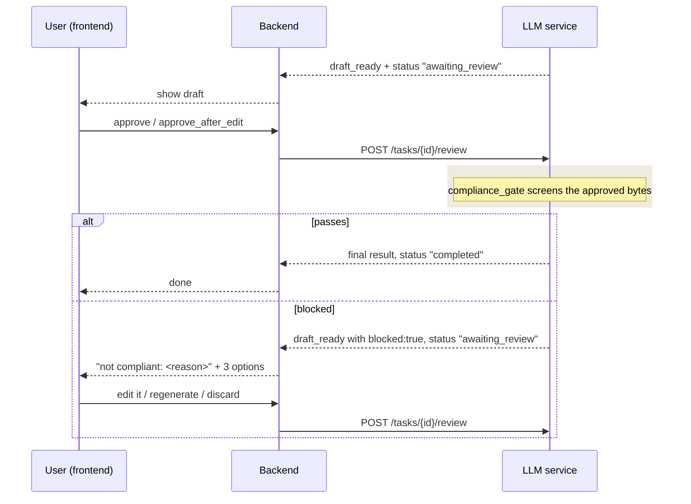

# Compliance Gate — Integration Guide

**Audience:** the backend (Java / `tsldemo`) and frontend (`frontend_service`) engineers integrating
this feature.
**Scope:** one behaviour change at the human review gate, plus the fields you need to handle it.
**Prerequisite:** general contract in [API.md](../API.md). This document is the complete spec for
this feature — you should not need to read the Python.

---

## 1. What changed, in one paragraph

Content Safety used to run in exactly one place: on the copy the **model** wrote, before it reached
you. It now also runs on the copy the **human approved** — including text the human typed
themselves — in a step called `compliance_gate`, sitting between the review gate and content
production. If that final screen passes, nothing about your integration changes. If it **blocks**,
the platform is not finalized: it returns to the review gate carrying the reason, and the user picks
one of three ways forward.

**No new endpoints.** All three options are ordinary verdicts on the review endpoint you already
call. **No breaking changes.** Every field described here is absent from payloads unless a block
actually occurred.

---

## 2. Flow



The blocked branch is a **loop**, not a dead end: an edit that is still non-compliant blocks again.
It always terminates, because every lap requires a fresh human decision and two of the three options
end it outright.

---

## 3. Detecting a block

A blocked platform arrives exactly like any other pending gate — same endpoint, same shape — with
three extra fields.

### On the task snapshot (`GET /tasks/{id}`, and the `POST /review` response)

```jsonc
{
  "task_id": "sess-1a2b3c4d5e6f",
  "status": "awaiting_review",
  "pending": [
    {
      "request_id": "0f1e2d…",
      "platform": "linkedin",
      "draft": "…the exact copy that was blocked…",
      "comment": "compliance block: this content is NOT compliant and cannot be published as written (hate_speech severity 4). Please revise the copy and approve again, or reject it to have a new version drafted.",
      "needs_human_intervention": true,

      "blocked": true,
      "block_reason": "hate_speech severity 4",
      "allowed_decisions": ["approve_after_edit", "reject", "discard"]
    }
  ],
  "outputs": []
}
```

### On the SSE stream (`GET /tasks/{id}/events`)

The same three fields ride on that platform's `draft_ready` event, so it does not matter which
surface you drive your UI from:

```jsonc
{ "type": "result", "node": "creator", "phase": "create", "platform": "linkedin",
  "status": "draft_ready", "seq": 42, "ts": 1781105228.4,
  "draft": "…", "critic_comment": "compliance block: …",
  "needs_human_intervention": true,
  "blocked": true,
  "block_reason": "hate_speech severity 4",
  "allowed_decisions": ["approve_after_edit", "reject", "discard"] }
```

### Field reference

| Field | Type | Present | Meaning |
|---|---|---|---|
| `blocked` | boolean | **only when `true`** | This gate re-opened because the approved copy failed the final Content Safety screen. **Absent means not blocked** — it is never sent as `false`. Test for presence/truthiness, not equality with `false`. |
| `block_reason` | string | only when blocked | The raw reason from Content Safety (e.g. `"hate_speech severity 4"`). Use this to compose your own message or localize it. |
| `allowed_decisions` | string[] | only when blocked | The verdicts that can resolve this gate, in the order to present them. Render one control per entry rather than hard-coding the list. |
| `comment` | string | always | Human-readable English sentence. Already carried the reviewer's note before this feature; on a block it carries the compliance message and starts with `compliance block:`. Use `block_reason` instead if you write your own copy. |
| `needs_human_intervention` | boolean | always | Already existed. `true` on a block. **Not** a block indicator on its own — it is also `true` when the AI reviewer rejected a draft three times. Use `blocked` to tell them apart. |

> **Do not detect a block by string-matching `comment`.** Use `blocked`. The prose may be reworded
> or translated; the field will not.

---

## 4. The three options

Present exactly the entries in `allowed_decisions`. All three are sent to the endpoint you already
use:

```
POST /tasks/{task_id}/review
Content-Type: application/json

{ "verdicts": { "<platform>": { … } } }
```

### Option 1 — Edit it myself

```json
{ "verdicts": { "linkedin": { "decision": "approve_after_edit", "edited_draft": "…revised copy…" } } }
```

The user's text is screened again on the way through.
- Clean → that platform finalizes normally (`final` event, `outputs` entry).
- Still non-compliant → the gate re-opens again with the **new** `block_reason`.

`edited_draft` is required; omitting it returns `400`.

### Option 2 — Regenerate (creator drafts a new version)

```json
{ "verdicts": { "linkedin": { "decision": "reject" } } }
```

**You do not need to send a `reason`.** The service hands the creator the block reason
automatically, as an explicit instruction:

> `the previous copy was blocked by content safety (hate_speech severity 4) — rewrite it so it cannot trip that again`

Send a `reason` only if the user wants to steer it further ("also make it shorter"); it is appended
after the automatic steer, not instead of it.

The new draft goes through the AI reviewer and comes back as an **ordinary** pending gate for that
platform — a fresh `draft_ready` with **no `blocked` key**. Treat it as a normal review: `comment`
and `needs_human_intervention` mean what they always did (if the reviewer itself is unhappy with the
new version, you get the usual circuit-breaker flag — that is not a compliance block).

### Option 3 — Discard

```json
{ "verdicts": { "linkedin": { "decision": "discard", "reason": "not worth the rework" } } }
```

The platform is abandoned: nothing is published, nothing is retried. `reason` is optional and only
recorded.

You get:

- a **`discarded` result event** on the SSE stream —
  `{"type":"result","node":"human_gate","status":"discarded","platform":"linkedin","reason":"not worth the rework"}`
- a **`discarded` array on the snapshot** — `[{"platform": "linkedin", "reason": "not worth the rework"}]`
  (absent entirely when nothing was discarded)
- **no `outputs` entry and no `final` event for that platform, ever.**

> ⚠️ If your UI waits for a `final` event to settle a platform's card, it will wait forever on a
> discarded platform. Settle on `discarded` too.

Once every platform is resolved (finalized or discarded) the task reaches `completed` as usual — a
run where everything was discarded completes with `outputs: []`.

### Verdict summary

| Option | `decision` | Required | Outcome |
|---|---|---|---|
| Edit it myself | `approve_after_edit` | `edited_draft` | Re-screened; ships if clean, re-blocks if not |
| Regenerate | `reject` | — (`reason` optional) | New draft → reviewer → ordinary gate |
| Discard | `discard` | — (`reason` optional) | Platform abandoned; `discarded` event + snapshot entry |

**`approve` is deliberately not offered on a blocked gate.** Re-sending the same copy is screened
again and blocked again — it is not a way through. This is intentional: a compliance block is a
hard control, not a preference the approver may waive. Sending it is not an error (you get `400`
only for an unknown decision), it simply bounces.

---

## 5. Required changes

### 5.1 Backend — bound any auto-approve loop ⚠️ **REQUIRED**

This is the one change that is not optional. A loop of the form "approve everything until the task
stops being `awaiting_review`" **never terminates** against a blocked draft, because a block returns
the task to `awaiting_review`. Each lap costs a full workflow resume and a Content Safety call.

Current code in `NewsroomRunner.run()`:

```java
// ❌ never terminates against a compliance block
while ("awaiting_review".equals(task.status)) {
    Map<String, Verdict> verdicts = new HashMap<>();
    for (Pending pending : task.pending) {
        verdicts.put(pending.platform(), new Verdict("approve", null, null));
    }
    task = agentServ.reviewTask(taskId, new ReviewRequest(verdicts));
}
```

Minimal fix — hand a blocked platform to the human instead of re-approving it:

```java
Set<String> approvedOnce = new HashSet<>();
while ("awaiting_review".equals(task.status)) {
    Map<String, Verdict> verdicts = new HashMap<>();
    for (Pending p : task.pending) {
        if (Boolean.TRUE.equals(p.blocked())) return task;  // needs a human decision
        if (!approvedOnce.add(p.platform())) return task;   // belt-and-braces
        verdicts.put(p.platform(), new Verdict("approve", null, null));
    }
    task = agentServ.reviewTask(taskId, new ReviewRequest(verdicts));
}
```

Returning leaves the task `awaiting_review` so the review UI drives it from there.

### 5.2 Backend — DTO additions

Add the optional fields you want to read. Everything else is unchanged.

```java
public record Pending(
    String request_id, String platform, String draft, String comment,
    boolean needs_human_intervention,
    Boolean blocked,                    // null when not blocked
    String block_reason,                // null when not blocked
    List<String> allowed_decisions      // null when not blocked
) {}

// Verdict already supports all three options — no change needed:
//   new Verdict("approve_after_edit", editedText, null)
//   new Verdict("reject",             null,       optionalNote)
//   new Verdict("discard",            null,       optionalNote)

// Optional: to surface discards on the snapshot
public record Discarded(String platform, String reason) {}
// …and on TaskSnapshot:  public List<Discarded> discarded;   // null when nothing discarded
```

Jackson 3 (Spring Boot 4) ignores unknown properties by default, so you can adopt these fields
whenever you like — payloads without them keep deserializing either way.

### 5.3 Frontend

| # | Change | Why |
|---|---|---|
| 1 | Read `critic_comment` / `blocked` / `block_reason` off the `draft_ready` event | The block reason is currently discarded, so the user is told nothing about why. |
| 2 | Key the draft card by `platform`; a new `draft_ready` for the same platform **supersedes** the existing card | Otherwise each block appends another card for the same platform. |
| 3 | When `blocked`, render a block state — not the existing amber "the AI reviewer flagged this draft" notice | That notice describes `needs_human_intervention` from the circuit breaker, which is a different situation. |
| 4 | Render one control per `allowed_decisions` entry: **Edit** (needs a text input → `approve_after_edit`), **Regenerate** (`reject`), **Discard** (`discard`) | The Edit affordance does not exist today; without it the user cannot take the fastest way out. |
| 5 | Don't show "approved / queued for publishing" until the `final` event for that platform lands | Today it is shown optimistically on click, which is wrong when the approval is then blocked. |
| 6 | Settle a card on a `discarded` event | A discarded platform never emits `final`. |
| 7 | *(cosmetic)* Add a `compliance_gate` label to your node→status-text map | Otherwise that step shows blank in the progress timeline. |

---

## 6. Worked example

```jsonc
// 1. User approves the draft
POST /tasks/sess-abc/review
{ "verdicts": { "linkedin": { "decision": "approve" } } }

// → blocked: the gate re-opens instead of finalizing
{ "task_id": "sess-abc", "status": "awaiting_review",
  "pending": [ { "request_id": "req-2", "platform": "linkedin",
                 "draft": "…", "comment": "compliance block: …",
                 "needs_human_intervention": true,
                 "blocked": true, "block_reason": "self_harm severity 2",
                 "allowed_decisions": ["approve_after_edit", "reject", "discard"] } ],
  "outputs": [] }

// 2a. User edits (option 1)
POST /tasks/sess-abc/review
{ "verdicts": { "linkedin": { "decision": "approve_after_edit",
                              "edited_draft": "A compliant rewrite." } } }
// → { "status": "completed", "outputs": [ { "platform": "linkedin",
//      "draft": "A compliant rewrite.", "decision": "approve_after_edit", … } ] }

// 2b. …or regenerates (option 2)
POST /tasks/sess-abc/review
{ "verdicts": { "linkedin": { "decision": "reject" } } }
// → { "status": "awaiting_review",
//      "pending": [ { "platform": "linkedin", "draft": "…a new version…",
//                     "comment": "…the reviewer's note…",
//                     "needs_human_intervention": false } ] }   // note: no `blocked` key

// 2c. …or discards (option 3)
POST /tasks/sess-abc/review
{ "verdicts": { "linkedin": { "decision": "discard" } } }
// → { "status": "completed", "outputs": [],
//      "discarded": [ { "platform": "linkedin", "reason": null } ] }
```

---

## 7. Notes and edge cases

**Per-platform.** Everything here is scoped to one platform. In a multi-platform run a block on
`linkedin` does not affect `instagram` — the compliant one finalizes normally while the blocked one
waits. Address them together or separately in the same `verdicts` object; unaddressed platforms stay
pending.

**Multiple blocks in a row.** Each re-opened gate is a fresh `request_id` and a fresh `draft_ready`
event with the new reason. There is no cap: an edit that is still non-compliant blocks again, every
time. This cannot spin on its own, because each lap requires a human verdict.

**Media-only runs** (`content_types` without `"text"`) have no review gate, so none of this applies
to them.

**Errors.** `400` for an unknown `decision`, for `approve_after_edit` without `edited_draft`, or for
verdicts matching no pending platform. `409` if the task is not currently `awaiting_review`. `404`
for an unknown task. Same as before — this feature adds no new error codes.

**Testing it locally.** With the service in mock mode (the default), Content Safety blocks any text
containing the word `unsafe`. Run any task to the gate and submit
`{"decision": "approve_after_edit", "edited_draft": "an unsafe rewrite"}` to see the blocked payload
and exercise all three options.
