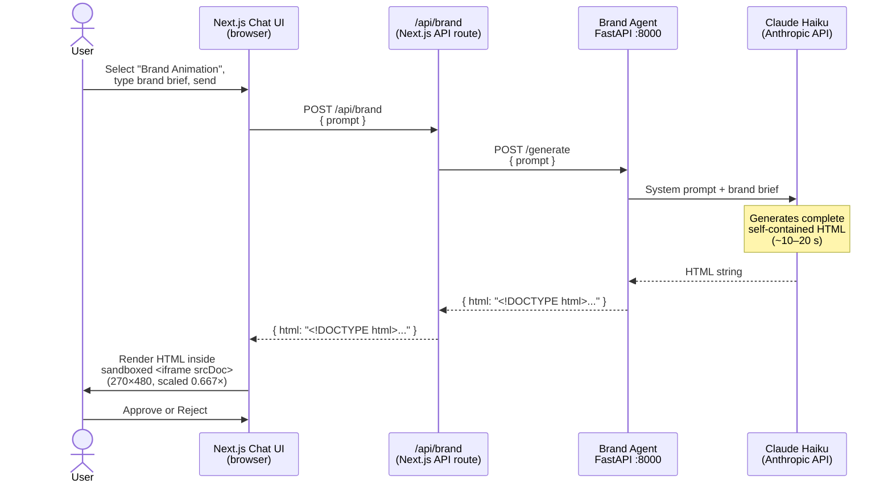

# Brand Animation Agent

Generates a self-contained, animated HTML card from a free-text brand brief. The card is a 9:16 portrait format (360×640 px) with three auto-advancing scenes built from inline SVG, CSS keyframe animations, and vanilla JavaScript — no external dependencies.

---

## Tech Stack

| Layer | Technology |
|---|---|
| API server | FastAPI + Uvicorn |
| LLM | Claude Haiku (`claude-haiku-4-5-20251001`) via `langchain-anthropic` |
| Prompt chain | LangChain `ChatPromptTemplate` → `StrOutputParser` |
| Output | Raw HTML string (self-contained, no external assets) |
| Container | Python 3.13-slim Docker image |

---

## Endpoints

| Method | Path | Description |
|---|---|---|
| `POST` | `/generate` | Accepts a brand brief, returns a self-contained HTML string |

### `POST /generate`

**Request**
```json
{ "prompt": "Luna Skincare — minimalist Gen Z skincare. Colors: soft lilac (#C8B8E8). Tagline: Skin, simplified." }
```

**Response**
```json
{ "html": "<!DOCTYPE html><html lang=\"en\">..." }
```

**Errors**
- `400` — empty prompt
- `500` — LLM or generation failure

---

## How It Works

The agent runs as a single synchronous call: the brief goes in, a complete HTML document comes out. Typical response time is **10–20 seconds**.

The LLM receives a detailed system prompt instructing it to produce a complete `<!DOCTYPE html>` document with:
- Three `<section>` scenes, each styled as a full-bleed 360×640 card
- CSS `@keyframes` for entrance animations per scene
- A vanilla JS scene-advance loop (4-second intervals) with dot navigation
- All styles and scripts inlined — no `<link>` or `<script src>` tags

After generation, the server strips any markdown fence wrapping (` ```html … ``` `) the model may add before returning the raw HTML.

The Next.js frontend proxies this call through `/api/brand` so the agent's hostname (`brand-agent:8000`) is never exposed to the browser. The returned HTML is injected into a sandboxed `<iframe srcDoc>` inside the chat thread.

---

## Communication Diagram



---

## ⚠️ Proof of Concept

> This agent backend is a **proof of concept** and will almost certainly change in future iterations. Known limitations and planned changes include:
>
> - **No streaming** — the full HTML is returned as a single response. A future implementation may stream the HTML progressively or use a structured generation approach (scene by scene).
> - **No persistence** — generated cards are not stored anywhere; a page refresh loses the result.
> - **Single LLM call** — the entire HTML document is generated in one shot. This works for short outputs but is fragile for larger or more complex templates; a dedicated templating layer with LLM-filled slots is the likely long-term architecture.
> - **Brand context** — the agent currently takes a raw text brief. The production system will pass structured brand profile data from the main LangGraph pipeline.
> - **Port/service structure** — the current setup (standalone FastAPI on port 8000) is temporary. This agent will be refactored as a node within the main LangGraph multi-agent orchestration.
