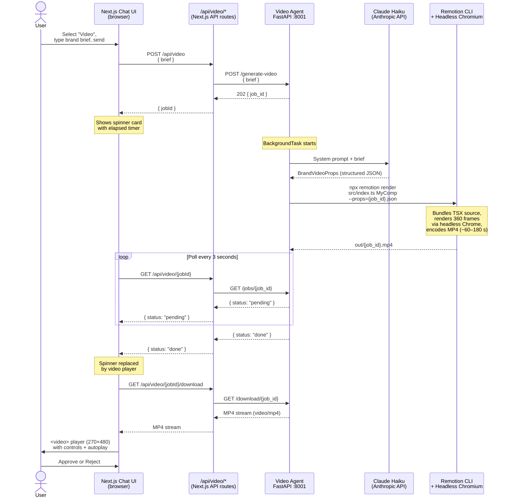

# Brand Video Agent

Generates a 12-second branded MP4 video (1080×1920, 9:16 portrait, 30 fps) from a free-text brand brief. The video is composed of three animated scenes rendered by [Remotion](https://www.remotion.dev/) using headless Chromium. Because rendering is CPU-intensive, the agent exposes an async job API: the client submits a brief, receives a job ID immediately, and polls for completion.

---

## Tech Stack

| Layer | Technology |
|---|---|
| API server | FastAPI + Uvicorn |
| LLM | Claude Haiku (`claude-haiku-4-5-20251001`) via `langchain-anthropic` |
| Structured output | LangChain structured output → Pydantic `BrandVideoProps` model |
| Video renderer | Remotion 4 (`npx remotion render`) + headless Chromium |
| Video encoding | ffmpeg (bundled in the container) |
| UI components | React 19 + Remotion `<Series>`, `<AbsoluteFill>`, spring/interpolate animations |
| Styling | Tailwind CSS v4 via `@remotion/tailwind-v4` |
| Container | Node 20 (Bookworm slim) + Python 3 in a single image |

### LLM-generated props (`BrandVideoProps`)

The LLM does not generate any visual code. It generates a structured JSON object that drives the Remotion composition:

| Field | Description |
|---|---|
| `brandName` | 1–2 words, ALL CAPS |
| `tagline` | 3–6 words |
| `primaryColor` | Dark background hex |
| `secondaryColor` | Main brand accent hex |
| `accentColor` | Complementary pop colour hex |
| `sectionLabel` | Scene 2 section header |
| `stats` | Exactly 3 `{ value, label, icon }` items |
| `headline` | Scene 3 CTA headline (ends with `?`) |
| `subtext` | Supporting sentence, max 12 words |
| `ctaLabel` | Button label, 2–4 words |
| `contact` | Handle or URL string |

---

## Endpoints

| Method | Path | Description |
|---|---|---|
| `POST` | `/generate-video` | Submit a brief; returns a job ID immediately (202) |
| `GET` | `/jobs/{job_id}` | Poll job status (`pending` / `done` / `error`) |
| `GET` | `/download/{job_id}` | Stream the completed MP4 as `video/mp4` |
| `GET` | `/out/{filename}` | Direct static access to rendered MP4 files |
| `GET` | `/health` | Health check |

### `POST /generate-video`

**Request**
```json
{ "brief": "NovaPulse — AI-powered fitness coaching app. Electric blue and neon green palette. Tagline: Train smarter." }
```

**Response** — `202 Accepted`
```json
{ "job_id": "a3f8c2d1-...", "status": "pending" }
```

### `GET /jobs/{job_id}`

**Response (pending)**
```json
{ "job_id": "a3f8c2d1-...", "status": "pending" }
```

**Response (done)**
```json
{
  "job_id": "a3f8c2d1-...",
  "status": "done",
  "download_url": "/out/a3f8c2d1-....mp4",
  "props": { "brandName": "NOVAPULSE", ... }
}
```

**Response (error)**
```json
{ "job_id": "a3f8c2d1-...", "status": "error", "error": "Remotion render failed (exit 1): ..." }
```

---

## How It Works

Render jobs are processed in a FastAPI `BackgroundTask`. The two-phase pipeline is:

1. **LLM phase** (~3–5 s) — Claude Haiku receives the brand brief and a creative director system prompt. It responds with a structured `BrandVideoProps` JSON object via LangChain's `.with_structured_output()`, validated against a Pydantic schema.

2. **Render phase** (~60–180 s) — The props are written to a temporary JSON file and passed to `npx remotion render src/index.ts MyComp <output>.mp4 --props=<tmpfile>`. Remotion bundles the TypeScript composition on the fly, launches headless Chromium, and renders 360 frames at 1080×1920. ffmpeg then encodes them into an MP4.

### Video composition

The Remotion composition (`src/Composition.tsx`) is a `<Series>` of three scenes, each 120 frames (4 seconds):

| Scene | Content | Key animations |
|---|---|---|
| **Scene 1** | Brand identity — logo hexagon, name, tagline | Spring scale-in, slide-up, expanding ring pulse, rule draw |
| **Scene 2** | Stats / highlights — three stat cards | Staggered slide-in from right, counter spring scale |
| **Scene 3** | CTA — headline, subtext, button, contact | Slide-up, fade-in, button spring, pulsing rings |

All animation values (colours, copy, stats) come from the LLM-generated props at render time.

### Frontend polling

The Next.js chat UI polls `/api/video/{jobId}` (a proxy to `/jobs/{job_id}`) every 3 seconds. The `BrandVideoCard` component manages the polling lifecycle locally via `useEffect` — no parent state updates are needed until the video is ready. Once `status === "done"`, the card switches from a spinner to a `<video>` element sourced from `/api/video/{jobId}/download`, which proxies the MP4 stream through Next.js so the browser never needs to reach `brand-video-agent:8001` directly.

---

## Communication Diagram



---

## ⚠️ Proof of Concept

> This agent backend is a **proof of concept** and will almost certainly change in future iterations. Known limitations and planned changes include:
>
> - **In-memory job store** — jobs are stored in a Python dict on the FastAPI process. All job state is lost on container restart. A production implementation would use a persistent job queue (e.g. Celery + Redis, or a database-backed task table).
> - **No render queue or concurrency limit** — multiple simultaneous render jobs will compete for the same Chromium instance and CPU. A worker-pool model with a bounded queue is required for production.
> - **Render time** — Remotion's on-the-fly bundling adds ~15–20 s per job because it recompiles the TypeScript composition from source each time. A pre-served bundle (via the `@remotion/renderer` Node.js API rather than the CLI) would eliminate this overhead.
> - **No file cleanup** — rendered MP4s accumulate in `out/` indefinitely. A TTL-based cleanup strategy is needed.
> - **Port/service structure** — the current setup (standalone FastAPI on port 8001, called via Next.js proxy routes) is temporary. This agent will be integrated as a node in the main LangGraph multi-agent pipeline, with video rendering dispatched as an async tool call.
> - **Brand context** — the agent takes a raw text brief. The production system will pass structured brand profile data and campaign context from the LangGraph orchestration layer.
