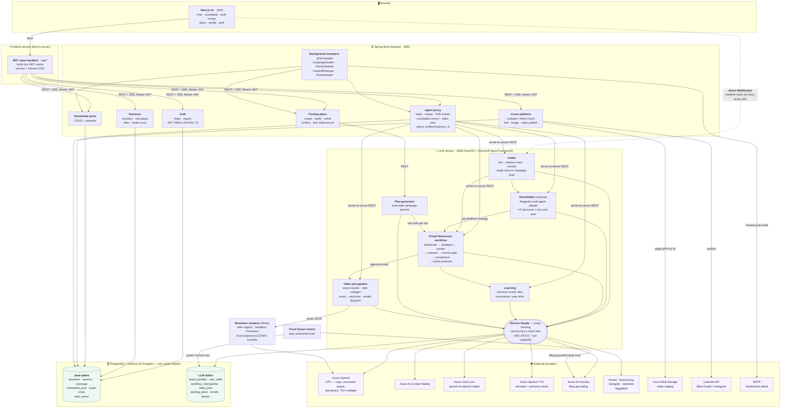
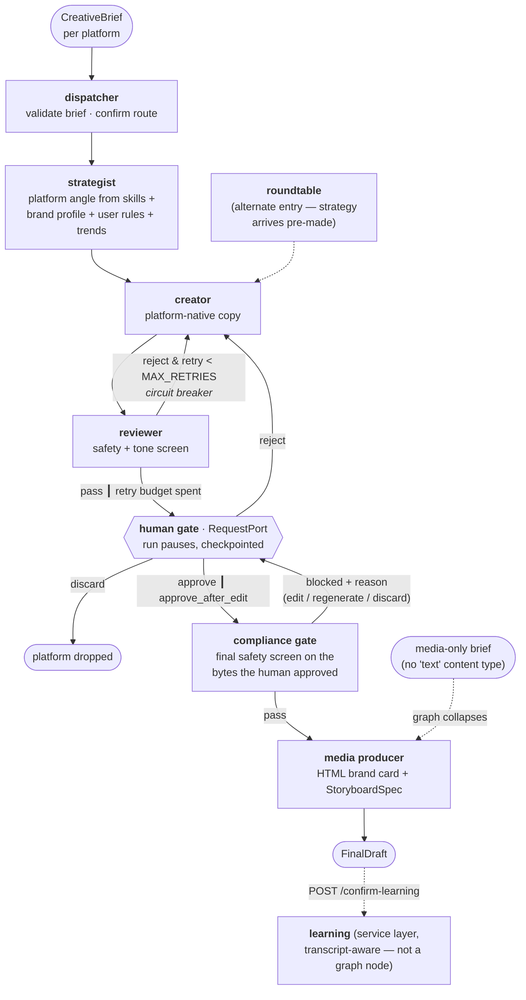
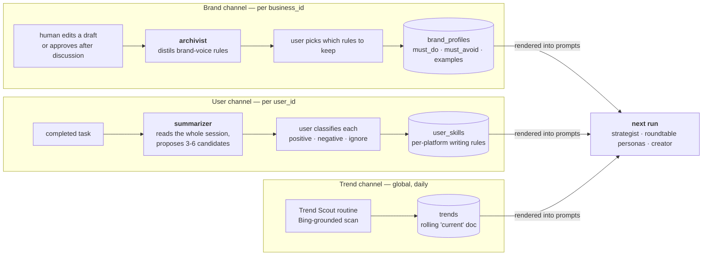
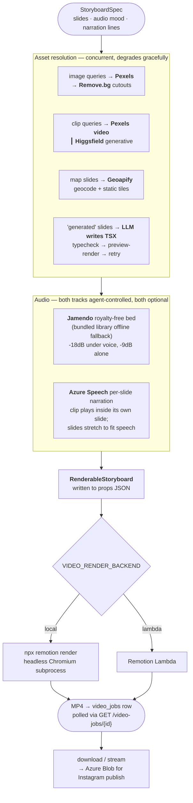
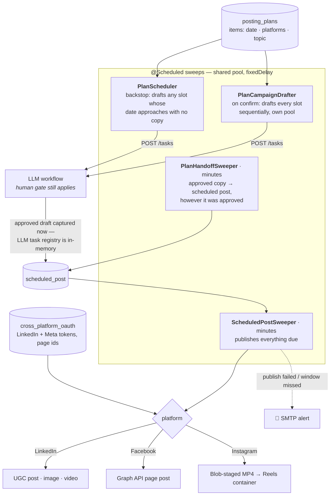

# TeamStarlight — System Architecture

Four runtimes, one shared Postgres world.

| Runtime | Tech | Port | Owns |
|---|---|---|---|
| `frontend_service` | Next.js (App Router) | 3000 | UI + a server-side BFF that holds the session cookie |
| `tsldemo` | Spring Boot (Java) | 8081 | Identity, persistence, scheduling, social publishing |
| `LLM_service` | FastAPI (Python) + MAF | 8080 | Intake, the agent workflow, learning, media & video jobs |
| `video_renderer` | Remotion (Node) | — | Storyboard → MP4, invoked as a subprocess or on Lambda |
| `trend_scout_routine` | Standalone Python | — | Daily Bing-grounded scan → `trends` table |

> **Trust boundary:** the LLM service has no auth of its own — it trusts `business_id` / `user_id`
> in the request body. Java is the only place identity is *verifiable* (it signs the JWT), so every
> HTTP path routes through it. The one exception is the browser's direct voice WebSocket.

---

## 1. Component architecture

---

## 2. End-to-end flow — idea to published post

```mermaid
flowchart LR
    A(["User opens chat"]) --> B["<b>Intake</b><br/>text or live voice"]
    B --> C{"<b>Classify</b><br/>one post, or a campaign?"}

    C -->|campaign| D["<b>CampaignBrief</b><br/>goal + date window"]
    D --> E["<b>Plan generator</b><br/>multi-date posting plan (draft)"]
    E --> F{"User confirms plan?"}
    F -->|refine / clarify| E
    F -->|confirm| G["<b>CampaignDrafter</b><br/>drafts every slot, one at a time"]
    G --> H

    C -->|one post| I["<b>CreativeBrief</b><br/>topic · platforms · tone · content types"]
    I --> H

    H{{"<b>Roundtable enabled?</b>"}}
    H -->|yes| J["<b>Discussion table</b> per platform<br/>personas debate · user can raise hand<br/>→ CreativeStrategy"]
    H -->|no| K["<b>Strategist</b><br/>plans strategy from skills,<br/>brand profile, user rules, trends"]
    J --> L
    K --> L

    L["<b>Newsroom pipeline</b><br/>draft → auto-review → human gate<br/>→ compliance screen"]
    L --> M["<b>Media producer</b><br/>animated HTML brand card<br/>+ StoryboardSpec JSON"]
    M --> N{"Render video?"}
    N -->|yes| O["<b>Video job</b><br/>assets · codegen · music · narration<br/>→ Remotion → MP4"]
    N -->|no| P
    O --> P

    P["<b>Approved copy captured to DB</b>"]
    P --> Q["<b>Handoff sweeper</b><br/>approved slot → scheduled_post row"]
    Q --> R["<b>Post sweeper</b> (per-minute)<br/>publishes anything due"]
    R --> S(["📤 LinkedIn · Facebook · Instagram"])

    L -.->|"after the run"| T["<b>Learning</b><br/>brand rules + user writing rules<br/>user confirms what is kept"]
    T -.->|"injected into every future draft"| K
    T -.-> J
```

---

## 3. The Virtual Newsroom workflow (MAF graph)

Each platform runs its own instance. Two gates protect the output: an automated circuit breaker
before a human ever sees a draft, and a final compliance screen on the exact bytes that will ship.

---

## 4. Personalization — two independent learning channels

Both are written only on explicit user confirmation, and both are injected into every
subsequent strategist, roundtable and creator prompt.

---

## 5. Video job pipeline

The workflow emits **data only** (`StoryboardSpec`). Rendering is a separate, explicitly-triggered,
pollable job — it takes 45s+ and must not block the run.

---

## 6. Scheduling & publishing (Java)

Every mechanism is **database-driven, not timer-driven** — the schedule outlives any process restart.

