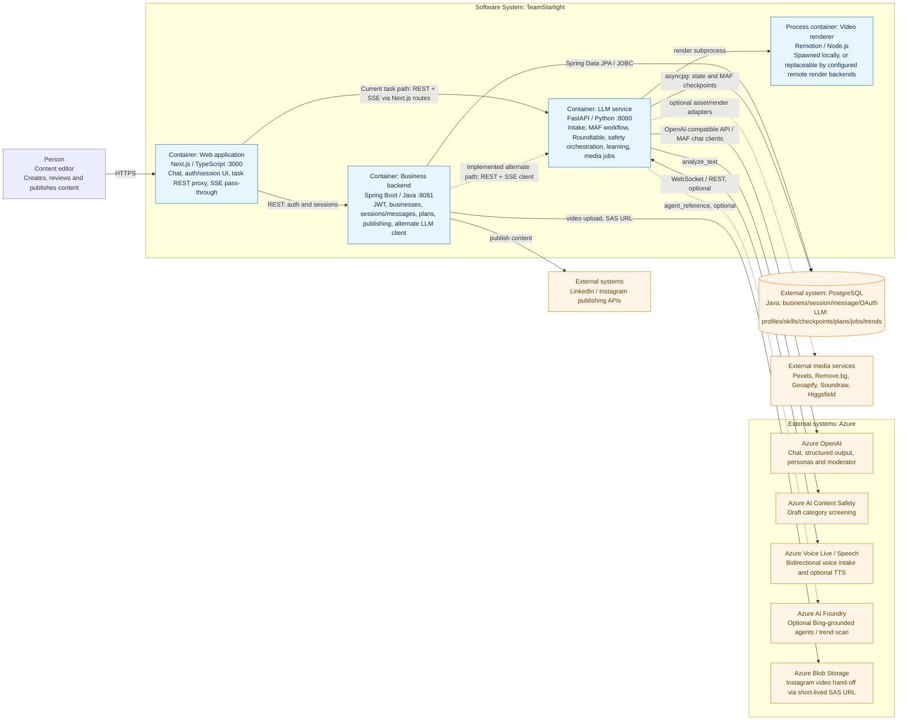

# C4 Context + Container Diagram

Status: implementation snapshot, 2026-08-01

This is a compact C4 Level 1/2 hybrid. It shows the people and external systems around TeamStarlight, then the independently executable containers inside the system boundary.

## Interpretation notes

1. The current Next.js task routes call `LLM_SERVICE_URL` directly for `POST /tasks`, task snapshots, reviews, controls, and SSE. Auth/session routes call the Java backend. Therefore Java is not the single gateway for the active chat generation path.
2. Java nevertheless contains an implemented `AgentService` for the FastAPI task API and an SSE relay controller. The dashed Java → LLM relationship means “code exists, but it is an alternate/partially integrated path,” not “future-only.”
3. Java and Python have separate database ownership. They may be configured against the same PostgreSQL service, but no cross-service transaction or single shared schema is guaranteed by the code.
4. The main MAF workflow can persist superstep checkpoints to PostgreSQL. The FastAPI task registry and SSE replay buffer remain process memory, and the Roundtable's Magentic workflow currently uses in-memory checkpoint storage.
5. Azure adapters are runtime-selectable. Mock implementations are the safe default in Python configuration; the root Compose file explicitly opts several services into live mode and therefore needs credentials.
6. The root Compose file is not currently a complete three-container topology: `frontend` depends on an undeclared `backend` service, and it does not set the `LLM_SERVICE_URL` consumed by the current task proxy routes.

## Primary implementation evidence

| Relationship | Evidence |
|---|---|
| Browser/Next.js → Java | `frontend_service/app/api/sessions/route.ts` |
| Browser/Next.js → LLM REST/SSE | `frontend_service/app/api/tasks/route.ts`, `frontend_service/app/api/tasks/[taskId]/events/route.ts` |
| Java → LLM REST/SSE | `tsldemo/.../AgentAPI/AgentService.java`, `AgentController.java` |
| Java → PostgreSQL | JPA repositories under `tsldemo/.../SessionAPI` and `SignInAPI` |
| LLM → PostgreSQL | `LLM_service/core/services/postgres.py`, `factory.py` |
| LLM → Azure OpenAI / Content Safety / Voice | `LLM_service/core/services/azure.py` |
| LLM → Azure AI Foundry | `LLM_service/core/services/web_search.py`, `trend_scout_routine/run_scan.py` |
| Java → Azure Blob | `tsldemo/.../CrossPlatformAPI/VideoStorageService.java` |
