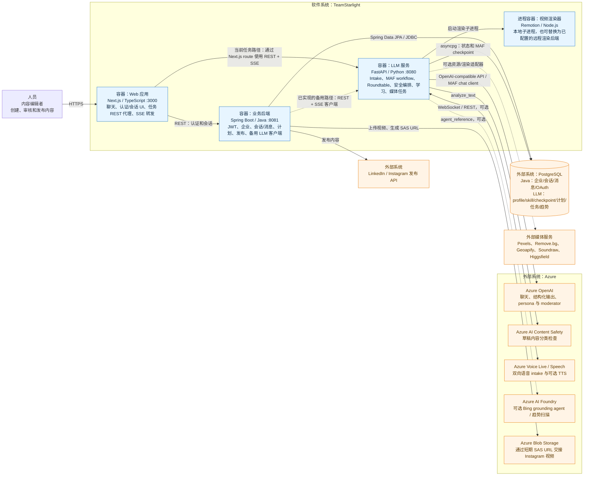

# C4 Context + Container 图

状态：基于实现的架构快照，2026-08-01

这是一张紧凑的 C4 Level 1/2 混合图：既展示 TeamStarlight 周围的人员和外部系统，也展示系统边界内可以独立运行的容器。

## 图示说明

1. 当前 Next.js task routes 会直接调用 `LLM_SERVICE_URL`，处理 `POST /tasks`、task snapshot、review、控制命令和 SSE；认证与会话 routes 才调用 Java backend。因此，Java 并不是当前聊天生成链路的唯一网关。
2. Java 中仍然存在已经实现的 `AgentService` 和 SSE relay controller。Java → LLM 的虚线表示“代码已经存在，但它是一条备用/未完全整合的路径”，而不是“尚未开发”。
3. Java 和 Python 分别拥有自己的数据库数据。二者可以被配置到同一个 PostgreSQL 服务，但代码没有提供跨服务事务，也不保证它们使用同一个 schema。
4. 主 MAF workflow 可以把 superstep checkpoint 持久化到 PostgreSQL，但 FastAPI task registry 和 SSE replay buffer 仍位于进程内存；Roundtable 的 Magentic workflow 当前同样使用内存 checkpoint。
5. Azure adapter 可以在运行时切换。Python 配置默认使用 mock；根目录 Compose 文件则明确把多个服务切换到了 live mode，因此需要外部凭据。
6. 根目录 Compose 文件目前并不是完整的三容器拓扑：`frontend` 依赖一个未定义的 `backend` service，同时也没有设置当前 task proxy routes 所读取的 `LLM_SERVICE_URL`。

## 主要实现证据

| 关系 | 代码证据 |
|---|---|
| 浏览器/Next.js → Java | `frontend_service/app/api/sessions/route.ts` |
| 浏览器/Next.js → LLM REST/SSE | `frontend_service/app/api/tasks/route.ts`、`frontend_service/app/api/tasks/[taskId]/events/route.ts` |
| Java → LLM REST/SSE | `tsldemo/.../AgentAPI/AgentService.java`、`AgentController.java` |
| Java → PostgreSQL | `tsldemo/.../SessionAPI` 和 `SignInAPI` 下的 JPA repository |
| LLM → PostgreSQL | `LLM_service/core/services/postgres.py`、`factory.py` |
| LLM → Azure OpenAI / Content Safety / Voice | `LLM_service/core/services/azure.py` |
| LLM → Azure AI Foundry | `LLM_service/core/services/web_search.py`、`trend_scout_routine/run_scan.py` |
| Java → Azure Blob | `tsldemo/.../CrossPlatformAPI/VideoStorageService.java` |

[查看英文版](../c4-context-container.md)
