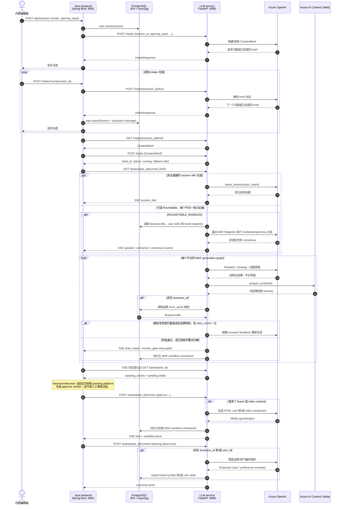

# Java backend、LLM service、PostgreSQL 与 Azure 时序图

状态：基于实现的 Java orchestration path，2026-08-01

下图追踪 Java `SessionService` / `NewsroomRunner` / `AgentService` 路径。它并不是浏览器当前唯一的执行路径：现有 Next.js `/api/tasks/**` routes 可以直接代理 FastAPI，从而在内容生成阶段绕过 Java。

## 重要边界

- **SSE 可能早于持久化完成。** LLM service 在消费 MAF stream 时会立刻发布转换后的 workflow event；对应 superstep 的 framework checkpoint 可能随后才写入。客户端收到 `draft_ready`，并不证明对应 checkpoint 已经持久化。
- **已经持久化不等于已经实现恢复。** PostgreSQL checkpoint storage 确实存在，但 `WorkflowService._tasks` 及其 event buffer 仍位于内存中。HTTP service 在进程重启后不会根据最新 checkpoint 自动重建 task record。
- **Roundtable 与主图的持久化能力不同。** 主 workflow 使用 `factory.get_checkpoint_storage()`；每个 Magentic Roundtable 当前使用 `InMemoryCheckpointStorage()`。
- **Safety 并不是不可绕过的发布门。** 自动重试次数耗尽后，被拦截的草稿会带着 `needs_human_intervention=true` 进入 Human Gate，但 Human Gate 仍然接受 `approve`；`approve_after_edit` 的编辑后内容也不会再次接受安全检查。
- **Java 自动批准属于 PoC 行为。** `NewsroomRunner.run()` 会批准所有 pending platform，随后调用 `confirm-learning(true)`。它不能作为已经执行人工审核或取得学习同意的证据。
- **图中的 PostgreSQL 是一个逻辑参与者。** Java 通过 Spring Data JPA 保存业务数据，Python 通过 asyncpg 保存 workflow/profile 文档；它们是否使用同一物理数据库或 cluster 取决于部署配置。

[查看英文版](../sequence-java-llm-postgres-azure.md)
