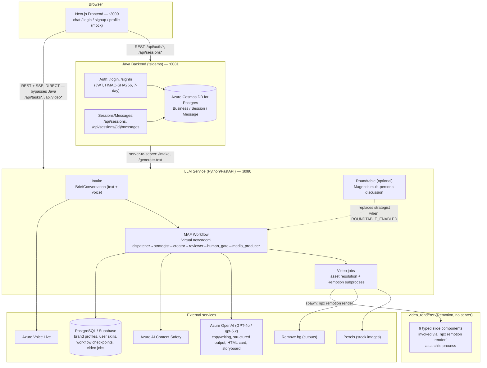
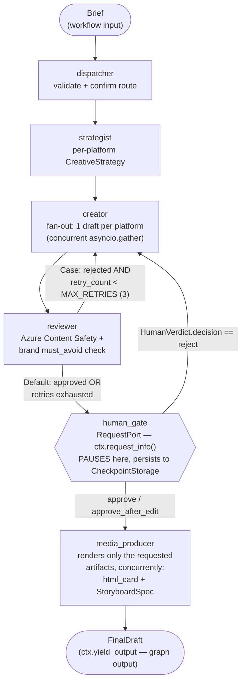
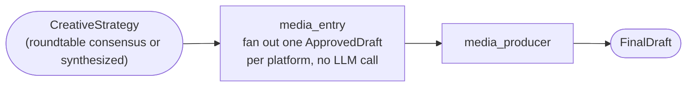
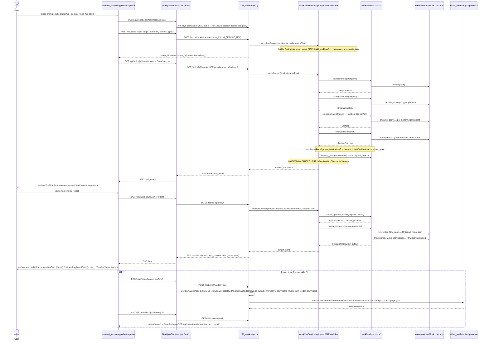

# TeamStarlight — System Breakdown & Onboarding Guide

> Written as a developer-onboarding reference. It covers: what each service does, how to run
> the system locally, how a single user prompt travels end-to-end into text/HTML/video output,
> a deep dive into the Microsoft Agent Framework (MAF) since it's the least-familiar piece of
> the stack, and a candid list of modularity/maintainability gaps worth knowing about before you
> start changing things.
>
> Everything below was verified against the actual source (file + line citations throughout),
> not just the existing docs — several of the existing `docs/*.md` / root `API.md` files have
> drifted from what the code actually does. Those drifts are called out explicitly wherever
> found, because they will otherwise cost you real debugging time.

---

## Table of contents

1. [30-second mental model](#1-30-second-mental-model)
2. [Repo map](#2-repo-map)
3. [Getting up and running](#3-getting-up-and-running)
4. [System architecture](#4-system-architecture)
5. [Microsoft Agent Framework — deep dive](#5-microsoft-agent-framework--deep-dive)
6. [The virtual newsroom workflow graph](#6-the-virtual-newsroom-workflow-graph)
7. [End-to-end trace: prompt → content](#7-end-to-end-trace-prompt--content)
8. [Service layer (mock ↔ production)](#8-service-layer-mock--production)
9. [Frontend architecture](#9-frontend-architecture)
10. [Java backend architecture](#10-java-backend-architecture)
11. [Video render pipeline](#11-video-render-pipeline)
12. [Roundtable (optional multi-agent discussion)](#12-roundtable-optional-multi-agent-discussion)
13. [Known doc/code drift](#13-known-doccode-drift)
14. [Modularity, maintainability, readability — findings](#14-modularity-maintainability-readability--findings)
15. [Further reading](#15-further-reading)

---

## 1. 30-second mental model

Four services, three languages, one conversation:

| Service | Language | Port | Job |
|---|---|---|---|
| `frontend_service` | Next.js/TS | 3000 | Chat UI, session sidebar, approve/reject gate, profile dashboard (mock) |
| `tsldemo` (Java "backend") | Spring Boot | 8081 | Auth (JWT), session/message persistence to Postgres |
| `LLM_service` | Python/FastAPI | 8080 | The actual AI pipeline: intake → **MAF workflow** → drafts → human gate → media |
| `video_renderer` | Remotion/TS | (none — CLI subprocess) | Turns a JSON video spec into an MP4, invoked as a child process by `LLM_service` |

The **Python service is where almost all the interesting logic lives**. It runs a small
graph-based multi-agent pipeline (built with Microsoft's Agent Framework) that drafts
platform-native social copy, screens it, pauses for a human to approve/edit/reject, and then
generates an animated HTML "brand card" and a dynamic video storyboard from the approved copy.

The Java backend is comparatively thin (auth + session/message CRUD) and the frontend's chat
page talks to the Python service **directly** for the actual generation work (see §7) — the
Java backend is not yet in that critical path end-to-end, which is worth knowing early.

---

## 2. Repo map

```
TeamStarlight/
├─ frontend_service/     Next.js 16 / React 19 app (chat UI, profile dashboard, auth pages)
├─ tsldemo/               Spring Boot 4 (Java 25) — auth + session/message persistence
├─ LLM_service/           FastAPI (Python) — intake, MAF workflow, media, video jobs
│  ├─ api.py              All HTTP/WS/SSE routes + the WorkflowService/IntakeService/MediaService/VideoService
│  ├─ main.py             Interactive CLI harness — exercises the whole system without HTTP
│  ├─ scenarios.py        Fixed, non-interactive showcase runs (for demos)
│  ├─ intake/             The brief-building conversation (text + voice share one engine)
│  ├─ workflow/           The MAF workflow itself
│  │  ├─ builder.py       Assembles the executor graph (THE most important file to read first)
│  │  ├─ messages.py      Every typed message that flows along the graph's edges
│  │  ├─ executors/       One file per node: dispatcher, strategist, creator, reviewer, human_gate, media_producer, media_entry
│  │  ├─ roundtable/      Optional multi-persona discussion stage (a *different* MAF orchestration pattern — Magentic);
│  │  │                   now includes control.py (next/speak/enough/auto user controls, §12) and an optional trend_scout seat
│  │  ├─ video/           Storyboard→MP4 render pipeline (subprocess or Remotion Lambda into video_renderer/);
│  │  │                   now also codegen.py (LLM-authored Remotion scenes), map_qa.py, fallback.py, voiceover.py, lambda_render.py (§11)
│  │  └─ learning/        Brand-voice + per-user rule distillation (post-hoc, opt-in)
│  ├─ core/
│  │  ├─ config.py        Settings + the mock/production feature-toggle system
│  │  ├─ events.py        The SSE wire-format builders
│  │  ├─ video_schema.py  The dynamic storyboard schema (Pydantic discriminated unions)
│  │  ├─ skill_schema.py  Per-user learned writing rules schema
│  │  ├─ trend_schema.py / trends.py   "Trend scout" context: TTL'd trend snippets read from Postgres (§6)
│  │  ├─ agent_tools.py   MAF/OpenAI-style tool defs (web search, reviews, images) — defined, not yet wired to an executor (§14)
│  │  └─ services/        base.py (contracts) / mock.py / azure.py / media_assets.py (Pexels/Remove.bg/Geoapify/Soundraw) /
│  │                       web_search.py (Azure AI Foundry Bing-grounding agents) / postgres.py / factory.py
│  ├─ skills/             Markdown style-guide "skills" injected into prompts (per platform + media);
│  │                       now incl. remotion_scene_patterns.md for the codegen LLM (§11)
│  ├─ migrations/         Hand-written SQL for the Postgres tables (incl. 003_trends.sql)
│  └─ tests/               ~5,000+ lines of pytest — read these to see the contracts exercised
├─ video_renderer/         Remotion project — 10 typed "slide" React components (incl. MapSlide) + a shared
│                           design-token system (src/design/) + a generic composition
├─ docs/                   Design docs — some current, some stale (see §13)
├─ API.md                  Root-level API reference for `LLM_service` (also partly stale, see §13)
└─ system.md                Existing architecture doc with mermaid diagrams (a good second read)
```

---

## 3. Getting up and running

### Fastest path: Docker Compose (everything, mock mode)

```bash
cp .env.example .env      # for the (currently disabled) Anthropic-backed demo agents — see note below
docker compose up --build
```

This starts `frontend` (3000), `backend` (8081), and `llm` (8080). Look at
`docker-compose.yml` closely though:

- The `llm` service is started with **`USE_MOCK=false`** and now individually flips on several
  more real integrations than before — `USE_MOCK_IMAGE_SEARCH=false`,
  `USE_MOCK_BACKGROUND_REMOVAL=false`, `USE_MOCK_WEB_SEARCH=false` all point at real Pexels/
  Remove.bg/Azure-AI-Foundry-Bing credentials — while others stay mock
  (`USE_MOCK_SAFETY=true`, `USE_MOCK_MUSIC_GENERATION=true`, `USE_MOCK_STORE=true`,
  `USE_MOCK_VOICEOVER=true`). So a stock `docker compose up` will try to hit **real Azure
  OpenAI, Pexels, Remove.bg, Geoapify, and an Azure AI Foundry web-search agent**, using
  whatever `AZURE_OPENAI_ENDPOINT`/`AZURE_OPENAI_API_KEY`/`FOUNDRY_PROJECT_ENDPOINT`/
  `GEOAPIFY_API_KEY`/etc. you have in your shell env or root `.env` (docker-compose interpolates
  `${VAR}` from there). **If you don't have those credentials, export `USE_MOCK=true` (or unset
  it) before composing up**, or the `llm` container will raise `RuntimeError` on first request
  for whichever integration is missing creds (see `factory._require`, §8). Remotion Lambda video
  rendering is the one integration still commented out / off by default
  (`VIDEO_RENDER_BACKEND=lambda` and its `REMOTION_LAMBDA_*` vars) — see §11 for why.
- The `brand-agent` service (the old Anthropic-backed demo, port 8000) is **commented out**.
  The root `.env.example`'s `ANTHROPIC_API_KEY` note and the frontend's `/api/brand` route
  both refer to a service that no longer exists in the compose file or on disk (see §13).
- `tsldemo`'s own `compose.yaml` only stands up a **local Postgres** container — it is not
  the database the Java app actually connects to (see §10); it's disconnected/legacy.

### Running each piece standalone (recommended while developing)

**Python LLM service** — everything defaults to mock (no credentials needed):
```bash
cd LLM_service
pip install -r requirements.txt -r requirements-dev.txt
python -m LLM_service.api          # from the repo root, so the package import resolves
# → http://localhost:8080/docs     (Swagger UI, generated from the FastAPI schema)
```
Or drive the whole system without any HTTP layer at all — useful for understanding the
pipeline before touching the API:
```bash
python -m LLM_service.main         # interactive CLI: build a brief, watch the workflow live,
                                    # approve/reject at the gate, opt into learning
```
Run the test suite (the best "spec" for how every piece is meant to behave):
```bash
pytest    # pytest.ini sets pythonpath=. and testpaths=LLM_service/tests, asyncio_mode=auto
```

**Java backend:**
```bash
cd tsldemo
./mvnw spring-boot:run     # port 8081; connects to the Azure Cosmos DB for Postgres
                            # instance hardcoded in application.properties (see §10 — this
                            # is a committed secret; treat it as compromised / rotate it)
```

**Frontend:**
```bash
cd frontend_service
npm install
npm run dev                # port 3000; needs BACKEND_URL / LLM_SERVICE_URL env vars
                            # (defaults to localhost:8081 / localhost:8080, matching the above)
```

**Video renderer** (only invoked automatically as a subprocess by `LLM_service`; to poke it
directly):
```bash
cd video_renderer
npm install
npm run studio              # remotion studio — visually preview the composition
npm run render               # remotion render src/index.tsx StoryboardVideo <out.mp4> --props=<json>
```

### The mock/production toggle (read this before touching Settings)

`LLM_service/core/config.py` + `core/services/factory.py` implement a clean **strategy
pattern**: every external dependency (LLM calls, content-safety screening, the Postgres store,
voice transport, image search, background removal, music generation, and — newly —
**web search/trend research** and **voiceover TTS**) has a `Mock*` and a production
(`Azure*`/`Postgres*`/vendor-specific) implementation behind a common ABC in
`core/services/base.py`. The list of independently-toggleable, independently-credentialed
integrations keeps growing (Pexels, Remove.bg, Geoapify, Soundraw, Azure Speech, Azure AI
Foundry Bing-grounding agents, and optionally AWS for Remotion Lambda) — see `.env.example` for
the current full set before assuming `USE_MOCK=false` alone is enough to go live.
Resolution order is `USE_MOCK_<SERVICE>` env var → global `USE_MOCK` → default `true`. This
means:

- The **entire system runs offline, deterministically, for free**, by default — this is how
  the 3,650-line test suite runs in CI without any cloud credentials.
- You can flip on real services **one at a time** (e.g. `USE_MOCK_LLM=false` while everything
  else stays mock) to test a single integration in isolation.
- Production services fail loudly and immediately (`factory._require`, `core/services/factory.py:63-67`)
  if you flip them on without the matching credentials — never a silent fallback to mock.

---

## 4. System architecture



**The detail worth internalizing immediately**: the frontend's chat page calls the Python
`LLM_service` **directly** for all content generation (`/api/tasks*`, `/api/video*` proxy
straight to `LLM_SERVICE_URL`), while the Java backend is only used for **auth and session
persistence** (`/api/auth/*`, `/api/sessions*`). The two integrations are parallel, not
sequential — the Java backend does not sit in front of the generation pipeline today, even
though `docs/chat-api.md` describes a target design where it eventually would (see §13).

---

## 5. Microsoft Agent Framework — deep dive

You said you're unfamiliar with this, so this section is intentionally thorough. Skip to §6 if
you just want the graph.

### What it is

**Microsoft Agent Framework (MAF)** is Microsoft's SDK for building multi-step, multi-agent AI
systems — conceptually similar to LangGraph (graph-based orchestration) or AutoGen
(conversational multi-agent), but it's its own product/ecosystem, not built on either. This
repo pins it via pip:

```
agent-framework-core==1.9.0            # Executor / WorkflowBuilder / RequestPort / CheckpointStorage
agent-framework-orchestrations==1.0.0  # Magentic / GroupChat orchestration (the roundtable stage)
agent-framework-azure-ai               # Azure OpenAI / Foundry chat client bindings (optional)
```
(`LLM_service/requirements.txt:1-8`.) Note the comment there: MAF's orchestration API is a
"new/experimental GA surface whose API still shifts between releases" — hence pinned exactly,
not `>=`. Treat any generic MAF documentation you find online as potentially describing a
slightly different version than what's vendored here; when in doubt, trust the actual
`from agent_framework import ...` call sites in this repo over external docs.

There are **two distinct orchestration styles** used in this codebase, and conflating them is
the most common way to get confused:

1. **Plain graph workflow** (`WorkflowBuilder`) — used for the main "virtual newsroom" pipeline
   (§6). You define fixed executor nodes and edges yourself; routing is either static
   (`add_edge`) or conditional (`add_switch_case_edge_group`). This is the one to understand
   first — it's closer to a state machine / DAG than to a "conversation."
2. **Magentic orchestration** (`MagenticBuilder`, from `agent_framework.orchestrations`) — used
   only for the optional roundtable discussion (§12). This is a manager-moderated group chat:
   you hand it a list of participant agents and a "manager" that decides who speaks next each
   round, and it converges on a result rather than following a fixed graph. Think "AutoGen-style
   group chat," not "state machine."

### Core primitives (plain `WorkflowBuilder`, the one that matters most)

| Concept | What it is here | Example in this repo |
|---|---|---|
| `Executor` | A base class for one graph node. Subclass it, mark methods with `@handler`. | `class DispatcherExecutor(Executor):` (`workflow/executors/dispatcher.py:15`) |
| `@handler` | Decorates a method as "the function this executor runs when it receives a message of this input type." The **type annotation on the incoming parameter is the routing key** — MAF dispatches messages to whichever handler declares that type. | `async def dispatch(self, brief: Brief, ctx: WorkflowContext[DispatchPlan]) -> None:` (`dispatcher.py:17`) |
| `WorkflowContext[Out]` | Injected into every handler; `ctx.send_message(msg)` emits `msg` onto the executor's outgoing edge(s). The generic type parameter documents (and, for MAF's own tooling, validates) what type(s) the executor is allowed to emit. | `ctx.send_message(DispatchPlan(...))` (`dispatcher.py:25`) |
| `@response_handler` | A **second** handler on the same executor, used only by RequestPort nodes: it's invoked when a paused request receives its human response, and receives both the original request and the response. | `HumanGateExecutor.on_verdict(self, request: HumanReviewRequest, verdict: HumanVerdict, ctx)` (`human_gate.py:56`) |
| `WorkflowBuilder` | The graph assembler. `.add_edge(a, b)` wires a static edge; `.add_switch_case_edge_group(node, [Case(condition, target), Default(target)])` wires a **conditional** edge, evaluated against the message the node just emitted. `.build()` compiles the graph into a runnable `Workflow`. | `workflow/builder.py:120-138` |
| `Case` / `Default` | The branches of a switch-case edge group. `Case(condition=fn, target=executor)` routes to `target` when `fn(message)` is true; `Default(target=...)` is the fallback. | `Case(condition=_should_retry, target=creator)` (`builder.py:127`) |
| `ctx.request_info(payload, ResponseType)` | **The human-in-the-loop primitive.** Calling this inside a handler *pauses the workflow* — MAF persists the in-flight state to the attached `CheckpointStorage`, surfaces the payload as a `request_info` event to whoever is running the workflow, and suspends until someone resumes it with a value of `ResponseType`. | `human_gate.py:42-53` |
| `CheckpointStorage` | Where paused/in-flight workflow state is durably persisted, so a `request_info` pause survives a process restart. `InMemoryCheckpointStorage` for mock/dev; a custom `PostgresCheckpointStorage` in production (`core/services/postgres.py`). | `factory.get_checkpoint_storage()` (`core/services/factory.py:184-197`) |
| `workflow.run(message, stream=True)` | Runs (or resumes) the compiled workflow, yielding an **async stream of events** as it goes rather than returning only a final value. This is what makes SSE progress possible — the API layer is literally forwarding this event stream to the browser (see §7). | `LLM_service/api.py:285-289` |
| `workflow.run(responses=responses, stream=True)` | The **resume** call: instead of a fresh input message, you pass a dict of `{request_id: response_value}` to satisfy one or more pending `request_info` pauses and continue execution from where each one left off. | `api.py:288` |

### The event stream you actually consume

Iterating `workflow.run(..., stream=True)` yields event objects with a `.type` discriminator.
This repo's `WorkflowService._translate` (`api.py:229-267`) is the Rosetta stone for what each
one means:

| MAF event `.type` | Meaning | What `api.py` does with it |
|---|---|---|
| `executor_invoked` | A node just started running | → SSE `progress` event, `status: "running"` |
| `executor_completed` | A node finished | → SSE `progress` event, `status: "done"` |
| `executor_failed` / `error` | A node raised | → SSE `progress` event, `status: "error"` |
| `request_info` | A node called `ctx.request_info(...)` — the workflow is now **paused** | → SSE `result` event (`draft_ready`) + `progress` (`human_gate`, `status: "interrupted"`); the request's `request_id` is stashed in `task.pending` (`api.py:291-299`) so a later `POST /review` knows which pause to answer |
| `output` | A node called `ctx.yield_output(...)` — this is a **graph output**, not necessarily the end of the whole run | → SSE `result` event (`final`) carrying the `FinalDraft` |

The **workflow itself has no concept of "HTTP" or "SSE"** — all of that translation is a thin
adapter layer in `api.py`. The workflow only knows about typed Pydantic messages flowing along
edges and (optionally) pausing for external input. This separation is worth preserving if you
extend the graph: put "what does the frontend see" logic in `api.py`'s translation layer, not
in the executors.

### Why a graph (and not just a Python function calling an LLM four times)?

Three properties you get for free that a plain function chain wouldn't give you cleanly:

1. **Conditional routing as data, not control flow** — the circuit breaker (§6) is expressed as
   a `Case` condition on an edge, not an `if` statement buried in the reviewer. You can see the
   entire retry policy by reading `builder.py` alone, without reading any executor body.
2. **Pause/resume across a real boundary** — `ctx.request_info` isn't a blocking `input()` call;
   it suspends the *workflow's* execution and hands control back to the caller (`api.py`), which
   returns an HTTP response immediately. The workflow only continues when someone later calls
   `workflow.run(responses=...)` — which can happen in a completely different HTTP request,
   arbitrarily later, even after a process restart (because of `CheckpointStorage`).
3. **Fan-out for free** — the creator executor drafts every requested platform concurrently
   inside one handler (`asyncio.gather` over `CreativeStrategy.strategies`, `creator.py:96-101`)
   and emits one `Draft` message per platform; each flows through `reviewer`/`human_gate`
   independently. The graph doesn't need N duplicate node instances — one `CreatorExecutor`
   instance handles all platforms because routing is by *message type*, not by node identity.

---

## 6. The virtual newsroom workflow graph

This is `LLM_service/workflow/builder.py` — read the whole file, it's only 139 lines and is the
single best-organized file in the repo. Three graph shapes are actually built, chosen at start
time by `WorkflowService.start` (`api.py:376-391`) based on the brief's `content_types`:



**Media-only variant** (`content_types` requests `brand`/`video` but not `text` — Case 4 in the
docstrings): the whole create/review/gate path is skipped entirely.



**Roundtable-entry variant** (`ROUNDTABLE_ENABLED=true`): the discussion stage (§12) runs
*before* `build_workflow` is even called, producing the `CreativeStrategy` that a normal run
would have gotten from the strategist — so the graph is built with `roundtable_entry=True`,
which **starts at `creator`** and never builds `dispatcher`/`strategist` at all
(`builder.py:107-118`). Everything from `creator` onward is byte-identical in both modes.

### The circuit breaker, precisely

`builder.py:53-57`:
```python
def _should_retry(outcome: ReviewOutcome) -> bool:
    return not outcome.approved and outcome.retry_count < MAX_RETRIES
```
`MAX_RETRIES = 3` (`messages.py:32`). The reviewer never decides where to route — it only
reports `(approved, retry_count)` on `ReviewOutcome`; the *edge* decides. This is deliberate
(see the docstring at the top of `builder.py`): "no executor reads retry state across a service
boundary." If you need to change the retry policy, change `_should_retry` or `MAX_RETRIES` —
you should never need to touch `reviewer.py`.

### The human gate, precisely

`HumanGateExecutor` (`workflow/executors/human_gate.py`) has **two** handlers:

- `gate` (`@handler`, line 34) — receives a `ReviewOutcome`, wraps it as a `HumanReviewRequest`,
  and calls `ctx.request_info(request, HumanVerdict)`. This is where the workflow **pauses**.
  The `needs_human_intervention` flag is set to `not outcome.approved` — i.e. it's true
  precisely when a draft reached the gate via the circuit breaker rather than a clean approval,
  so the frontend can visually flag "this one needed 3 retries and still wasn't clean."
- `on_verdict` (`@response_handler`, line 56) — receives the same request plus the `HumanVerdict`
  that arrives when someone calls `POST /tasks/{id}/review`. Branches on `verdict.decision`:
  - `"reject"` → emits a **new `ReviewOutcome`** with `approved=False` and the human's `reason`
    as the comment, sent back to `creator` — re-drafting is triggered by the *same* message type
    the circuit breaker uses, so `creator.redraft` handles both a reviewer-rejection and a
    human-rejection identically (`creator.py:105-120`).
  - `"approve"` / `"approve_after_edit"` → emits an `ApprovedDraft` (using the human's edited
    text if provided) to `media_producer`.

### `MediaProducerExecutor` — the sole graph output

`workflow/executors/media_producer.py:34-77`. This is the **only** node that calls
`ctx.yield_output(...)`, so it's the only place the workflow's overall result comes from. It
renders the HTML brand card and/or the video storyboard **concurrently** via `asyncio.gather`
(line 64), and — importantly — only for the artifacts actually requested in
`brief.content_types`; an unrequested artifact is `None`, not generated at all (saving an LLM
call). Note this node does **not** render an MP4 — it only produces the `StoryboardSpec` JSON.
Actual video rendering is a separate, explicitly-triggered job (§11) kept out of this node on
purpose because it can take 45+ seconds and this is the workflow's terminal, must-stay-fast node.

### Trend scout — optional context injection (new)

Not a graph node — it never appears in `builder.py`. `StrategistExecutor.plan_strategies`
(`workflow/executors/strategist.py:34-46`) calls `core/trends.py`'s `read_current_trends()` once
per run and, if it returns anything, passes a rendered trend block into
`llm.plan_strategy(..., trends=trend_block)` so the LLM can angle a `CreativeStrategy` off a
real current event/trend instead of purely the brief. Gated by `TREND_SCOUT_ENABLED` (default
`false`, `core/config.py:221`); when off, `read_current_trends()` returns `[]` immediately
without touching the store. `select_current_trends()` (`core/trend_schema.py:70-110`) drops
TTL-expired rows (`TREND_SCOUT_TTL_DAYS`, default 3) and round-robins by category, capped at
`TREND_SCOUT_LIMIT` (default 6).

The trends themselves are **written by something outside this repo**: an external Foundry-agent
daily scan job upserts one rolling row (key `"current"`) into a new `trends` table
(`migrations/003_trends.sql`) via `StoreService.upsert_trends`
(`core/services/base.py:427-437`, implemented in `core/services/postgres.py:173-188`) — the
same whole-doc-in-JSONB pattern already used for `brand_profiles`/`user_skills`. If you're
looking for the scan job itself, it isn't in this repo; treat the `trends` table as an external
input the Python service only *reads*. The same trend block is also offered to an optional
fifth roundtable persona, `trend_scout` (§12).

A related but **not yet wired** piece: `core/agent_tools.py` defines a MAF/OpenAI-style tool
set (`search_web`, `fetch_url_text`, `search_reviews`, `search_images`, `search_stock_images`)
backed by a new `WebSearchService` (`MockWebSearch` / `AzureWebSearch` — the production impl
calls an Azure AI Foundry "Grounding with Bing Search" agent, `core/services/web_search.py`).
The module's own docstring says plainly that neither the strategist nor the creator calls these
tools yet — it's scaffolding for a future agentic research step, not live behavior (see §14).

---

## 7. End-to-end trace: prompt → content

This is the answer to "what files get touched when a user types a prompt and eventually gets
text/HTML/video back." Three artifacts, three slightly different paths after the shared
intake+draft+approve prefix.



### Files touched, in order, for a **text-only** run

1. `frontend_service/app/chat/page.tsx` — `handleSend()` → `genWorkflow()` (lines 396-547 per
   the file's current shape).
2. `frontend_service/app/api/tasks/route.ts` — thin proxy, `POST {LLM_SERVICE_URL}/tasks`.
3. `LLM_service/api.py` — `start_task` (line 1047) → `WorkflowService.start` (line 355).
4. `LLM_service/api.py` — `_brief_from_inputs` (line 151) builds the `Brief`; validates
   `content_types` via `_content_types_from_inputs` (line 127).
5. `LLM_service/workflow/builder.py` — `build_workflow(...)` assembles the graph.
6. `LLM_service/workflow/executors/dispatcher.py` → `strategist.py` → `creator.py` →
   `reviewer.py`, each calling out to `core/services/factory.get_llm()` (either `MockLLM` or
   `AzureLLM`, per `core/config.Settings`).
7. `LLM_service/workflow/executors/human_gate.py` — pauses; `api.py`'s `_translate` (line 229)
   turns the `request_info` event into the SSE `draft_ready` payload.
8. `frontend_service/app/api/tasks/[taskId]/events/route.ts` — SSE passthrough back to the
   browser's `EventSource`.
9. `frontend_service/app/chat/page.tsx` — renders `DraftCard`, wires Approve/Reject.
10. User approves → `frontend_service/app/api/tasks/[taskId]/review/route.ts` →
    `LLM_service/api.py` `review_task` (line 1090) → `WorkflowService.review` (line 483) →
    resumes the paused workflow with a `HumanVerdict`.
11. `workflow/executors/human_gate.py`'s `on_verdict` → `workflow/executors/media_producer.py`
    → `ctx.yield_output(FinalDraft(...))` with `html_card=None`, `video_storyboard=None` (neither
    requested) and `draft` = the approved text.
12. SSE `result/final` event flows back through the same proxy chain to the chat page, which
    appends it to `historyRef` and persists it via `POST /api/sessions/{id}/messages` →
    `tsldemo`'s `SessionController`/`SessionService` → Postgres.

### For **HTML** ("brand") and **video**, add:

- `media_producer.py`'s `_card()`/`_storyboard()` (lines 46-63) call `llm.render_html_card(...)`
  / `llm.generate_video_storyboard(...)` — both are single LLM calls that return, respectively,
  a self-contained HTML string and a `StoryboardSpec` (a discriminated union of typed slides,
  `core/video_schema.py`).
- The HTML rides straight through to the frontend as `html_preview` and is rendered client-side
  in a **sandboxed iframe** (`BrandAnimationCard`, `chat/page.tsx` lines ~1163-1235) — no server
  round-trip needed, it's a complete document already.
- The video **storyboard** (JSON) is shown as a static poster/preview
  (`VideoStoryboardCard`/`StoryboardPreview`). Actually producing an MP4 is a **separate, later
  step** the user triggers explicitly ("Render Video" button) — see §11.

---

## 8. Service layer (mock ↔ production)

`core/services/base.py` declares four ABCs the workflow depends on, each with a `Mock*`
implementation (`mock.py`, 889 lines — the biggest file in `core/`) and a production
implementation (`azure.py` / `postgres.py`):

| Contract | Mock impl | Production impl | Backs |
|---|---|---|---|
| `LLMService` | `MockLLM` | `AzureLLM` (Azure OpenAI/Foundry) | dispatcher, strategist, creator, media_producer, intake's `fill_brief` |
| `SafetyService` | `MockSafety` | `AzureSafety` (Azure AI Content Safety) | reviewer |
| `StoreService` | `MockStore` (in-memory dict) | `PostgresStore` | brand profiles, per-user learned skills, and (via a separate getter) workflow checkpoints |
| `VoiceService` | `MockVoice` | `AzureVoice` (Voice Live) | voice intake transport |

Plus narrower ones added for the video pipeline, all in the same pattern —
`ImageSearchService` (Pexels), `BackgroundRemovalService` (Remove.bg), `MusicGenerationService`
(Soundraw), `VoiceoverService` (`MockVoiceover` / `AzureSpeechVoiceover`, Azure Speech TTS —
backs the optional narration step, §11) — plus `WebSearchService` (`MockWebSearch` /
`AzureWebSearch`, an Azure AI Foundry Bing-grounding agent — backs `core/agent_tools.py`'s
not-yet-wired research tools and the optional `trend_scout` roundtable persona, §6/§12). Note
that the non-Azure production vendors (Pexels, Remove.bg, Geoapify, Soundraw) live grouped in
`core/services/media_assets.py` rather than `azure.py`, mirroring `azure.py`'s "one file per
provider family" shape.

**`tests/test_contract_parity.py`** is worth reading specifically: it asserts the mock and
production implementations return *structurally identical* shapes, which is what makes it safe
to develop/test entirely on mock and trust production will behave the same way.

`core/services/factory.py` is the **only place** that ever imports both `mock` and `azure`/
`postgres` modules and decides between them (`_cached`/`_require`, lines 48-67) — executors
never import `mock`/`azure` directly, only `factory.get_llm()` etc. This is a clean, worth-
copying pattern if you add a fifth external dependency later.

---

## 9. Frontend architecture

Next.js 16 (App Router) + React 19, no global state library (plain `useState`/`useRef`
throughout — confirmed no Redux/Zustand/Context anywhere in `app/`).

- **`app/chat/page.tsx`** (~1,300 lines) is the one file that matters for the generation flow:
  it owns the MAF SSE subscription, the draft/approve/reject UI, and the HTML-card/video-card
  rendering, all in one component (see §14 for why this is worth splitting up).
- **`app/api/**/route.ts`** are thin proxies. Two upstreams: `BACKEND_URL` (Java, for
  `/api/auth/*` and `/api/sessions*`) and `LLM_SERVICE_URL` (Python, for `/api/tasks*` and
  `/api/video*`) — direct, bypassing Java entirely (see the architecture note in §4).
- **`app/profile/*`** (BrandProfile, ApprovalQueue, ContentCalendar, FeedbackStats,
  SchedulePostModal) is a **fully mocked prototype** — none of it calls any real backend; it's
  UI-complete but disconnected from the actual pipeline. Good to know before you go looking for
  where "brand profile edits" persist — they currently don't.
- Auth token (`starlight_token`) and email (`starlight_user`) live in plain `localStorage`, set
  only from the login page. There's no route guarding — `/chat` and `/profile` render whether or
  not a token exists.

---

## 10. Java backend architecture

Spring Boot 4 / Java 25, package-by-feature (`SignInAPI/`, `LoginAPI/`, `SessionAPI/`,
`AgentAPI/`), three JPA entities at the package root (`Business`, `Session`, `Message`).

- **Auth**: `POST /login` checks credentials via **plaintext equality** (no hashing anywhere in
  the codebase) and issues a 7-day HMAC-SHA256 JWT (`auth/JwtUtil.java`) whose secret comes from
  `JWT_SECRET` (default: a hardcoded placeholder, `application.properties:20`). There is no
  Spring Security filter chain — every endpoint that wants the caller's identity manually parses
  the `Authorization` header itself, and several endpoints (message CRUD, the undocumented
  `GET /sessions`) don't check it at all.
- **Persistence**: Hibernate, `ddl-auto=update` (auto-migrates schema at boot), pointed at a
  **live Azure Cosmos DB for PostgreSQL instance with its password committed in plaintext** in
  `application.properties:7` — this is a real, currently-valid secret checked into source
  control and should be rotated and moved to an env var immediately regardless of anything else
  in this document.
- **Its own `compose.yaml`** stands up a *different*, local Postgres container that the app
  never actually connects to (no env wiring links them) — safe to ignore or treat as legacy.
- Only implements a fraction of what `docs/*.md` (approval-queue, brand-profile, the newer MAF
  `/tasks` proxy) describe — those are documented target features with zero corresponding Java
  code today (see §13). The calendar is the exception: it is now implemented, though not the way
  `docs/calendar-api.md` originally described it (see §13.3).

---

## 11. Video render pipeline

Two clearly separated stages, on purpose (rendering is slow; the workflow's terminal node must
stay fast). This pipeline had a substantial refactor since the graph itself was documented —
slides can now be either **fixed templates** or **LLM-authored code**, and the render step can
target either a local subprocess or Remotion Lambda.

1. **Spec generation** (fast, inside the MAF graph): `media_producer.py`'s `_storyboard()` calls
   `llm.generate_video_storyboard(...)`, returning a `StoryboardSpec` — an ordered list of typed
   slides validated by a Pydantic discriminated union (`core/video_schema.py`). The slide-type
   catalogue is now: `hook`, `counter_stat`, `collage`, `outro`, `pie_chart`, `line_chart`,
   `bar_chart`, `node_diagram`, `comparison_table`, **`map`** (pin/journey slides),
   **`statement`** and **`media_statement`** (big per-word typographic beats over an animated
   pixel mosaic / stock footage, new), and
   **`generated`** (an open-ended, LLM-authored scene, new — see step 2b). Most template slide
   types also now accept a per-slide `variant` (e.g. poster/split hooks, orbit/ticker stats,
   donut/exploded pie), and the storyboard as a whole can carry a shared `backdrop`/`transition`.
   This step is still **data only** — no images resolved, no code compiled, no MP4.
2. **Render job** (slow, explicitly triggered by `POST /tasks/{id}/render-video`, *not* part of
   the workflow graph, now also accepting optional `narration_text`/`narration_voice`):
   `workflow/video/jobs.py`'s `start_render_job` → `_run_job` (`jobs.py:34-70`) runs, in order:
   - `sweep_stale_generated()` (`codegen.py:168-188`) — reaps orphaned per-job codegen scratch
     directories left over from earlier crashed/aborted jobs.
   - `resolve_storyboard_assets` (`workflow/video/assets.py`) — turns each slide's
     `imageQuery`/`imageQueries` into real local image files via Pexels + Remove.bg; for a `map`
     slide, geocodes its pins and fetches a Geoapify static basemap
     (`_geocode_map_pins`/`_resolve_map_basemap`, `assets.py:146-199`), then runs `map_qa.py`'s
     `review_and_repair_map_slide` (below). Produces a `RenderableStoryboard` (fully resolved,
     camelCase, ready for React props).
   - `resolve_storyboard_music` — optionally attaches a generated background track (Soundraw, or
     mock).
   - **`resolve_storyboard_voiceover`** (new, `jobs.py:55-58`) — if `narration_text` was
     supplied, synthesizes narration audio via `VoiceoverService` (Azure Speech TTS, default
     voice `en-US-JennyNeural`, `VOICEOVER_DEFAULT_VOICE`) and attaches it to the job.
   - `render_storyboard` (`workflow/video/render.py:87-117`) — writes the renderable storyboard
     to `props.json`, resolves an entry point (a per-job generated entry point if any slide is
     `generated`, otherwise the normal `src/index.tsx`), then renders via whichever backend
     `VIDEO_RENDER_BACKEND` selects (below).
   - `cleanup_job_generated` runs in a `finally` block regardless of success/failure.
   - Job status/results are tracked in Postgres (`video_jobs` table) and polled via
     `GET /video-jobs/{job_id}` / downloaded via `GET /video-jobs/{job_id}/download`.

### 2b. `generated` slides — an LLM code-authoring loop (new)

`workflow/video/codegen.py:406-496`'s `generate_scene(...)` is a genuinely new capability: for a
`generated` slide, an LLM writes an actual Remotion React component rather than filling in a
fixed template's props. The loop, per slide:

1. `generate_scene_component` asks the LLM for TSX, guided by the new
   `skills/remotion_scene_patterns.md` skill (frame-deterministic patterns: SVG draw-on,
   odometer counters, staggered grids, radial bursts — plus hard rules like "no conditional
   hooks," "monotonic `interpolate` ranges").
2. The generated file is type-checked (`tsc --noEmit` against a per-job scratch tsconfig,
   `_write_job_tsconfig`, `codegen.py:143-157`).
3. A single-frame preview is rendered (`remotion still`, `codegen.py:292-332`) and passed through
   a **vision QA** pass (`review_scene_preview`) that looks at the actual rendered pixels.
4. On type-check failure or QA rejection, the LLM is asked to repair the code and the loop
   retries, bounded per-slide by `DEFAULT_MAX_ATTEMPTS = 3` and, across the *whole* storyboard,
   by a shared `CodegenBudget` (`CODEGEN_MAX_TOTAL_ATTEMPTS`, `codegen.py:78-99`) so one stubborn
   slide can't blow the render job's time budget alone.
5. If attempts are exhausted, `fallback.py`'s `fallback_slide_for` asks the LLM once more to
   re-express the same creative brief as the nearest **fixed template** slide type (map included)
   without any bespoke assets, or — as the absolute floor — degrades to a deterministic hook
   card. A `generated` slide is therefore never allowed to hard-fail a render job.

### Map slides and their QA loop (new)

`video_renderer/src/slides/MapSlide.tsx` renders pin markers (staggered spring drop-in + label
cards) in two modes: a **basemap mode** using a Geoapify raster tile fetched server-side
(pins reprojected with the same slippy-map math on both sides — `assets.py`'s `_mercator_y` and
`video_renderer/src/map/geo.ts`'s `mercatorY`, deliberately kept in sync per comments on both),
and a **vector fallback** using `world-atlas` TopoJSON country outlines
(`src/map/geo.ts` + `src/map/regionIndex.ts`'s alpha-2→numeric-ID lookup) projected with d3. It
supports a `variant: "pins" | "journey"` (an animated route line between pins).

Because a bad geocode or an ugly basemap composite (clipped/overlapping label cards, poor
contrast) would otherwise only be caught by a human watching the final video,
`workflow/video/map_qa.py`'s `review_and_repair_map_slide` renders a real preview still and runs
it through the same vision-QA mechanism as `codegen.py`, retrying with a wider zoom-out up to
`MAP_QA_MAX_ATTEMPTS` (default 2) before accepting the slide as-is. Gated by `MAP_QA_ENABLED`
(default `true`); skipped automatically when there's no basemap, the render backend is `lambda`,
or the renderer directory isn't reachable (`map_qa.py:75-83`).

### Local subprocess vs. Remotion Lambda (new)

`render.py` now branches on `VIDEO_RENDER_BACKEND` (default `"local"`):

- `"local"` — unchanged from before: shells out `npx remotion render src/index.tsx
  StoryboardVideo <out.mp4> --props=props.json --public-dir=<job_dir>`, `cwd` set to
  `video_renderer/`.
- `"lambda"` — `workflow/video/lambda_render.py`'s `render_on_lambda` deploys a per-job Remotion
  site (or reuses a pre-deployed `REMOTION_LAMBDA_SERVE_URL` when no `generated` slide requires a
  fresh bundle) via the new Node scripts `video_renderer/scripts/lambda-deploy-site.mjs` /
  `lambda-render.mjs`, and returns an S3 URL instead of a local file path. Configured via
  `REMOTION_LAMBDA_FUNCTION_NAME`, `REMOTION_LAMBDA_SERVE_URL`, `REMOTION_LAMBDA_SITE_NAME_PREFIX`,
  `REMOTION_LAMBDA_OUTPUT_BUCKET`, `AWS_REGION`. **This path is explicitly flagged in its own
  source comments as unverified against a live AWS account** (`lambda_render.py:17-23`) — treat
  it as untested if you're the one who ends up flipping it on.

### Shared design system (new)

`video_renderer/src/design/` (`tokens.ts`, `palettes.ts`, `fonts.ts`, `animations.ts`,
`backdrops.tsx`, `components.tsx`, `shapes.ts`) plus `src/slides/theme.ts` is a new shared
styling layer — slide components (e.g. `BarChartSlide.tsx`, `HookSlide.tsx`) now import shared
tokens/animations/palettes/theme helpers from here instead of styling ad hoc per slide. There's
now also a small Vitest suite (`video_renderer/vitest.config.ts`) covering the pure
design-system functions (`src/design/__tests__/*.test.ts`) — but it does **not** cover the slide
components, `Composition.tsx`, or the registry, and there's no CI workflow in the repo to run it
automatically; it closes part of the schema-mirror gap below only if someone runs it by hand.

`video_renderer/src/types.ts` is still a **hand-maintained, line-for-line mirror** of the
`Render*` Pydantic models in `core/video_schema.py` — there is no shared schema/codegen step,
only explicit "KEEP IN SYNC WITH" comments on both sides and a **Python-only** test
(`tests/test_video_schema.py::test_slide_type_registry_matches_implemented_models`). Adding a
new slide type still means touching three places by hand (the Python `Spec`+`Render` model pair,
the TS interface, and `video_renderer/src/registry.ts`'s `SLIDE_REGISTRY`), and — as above — the
new Vitest suite doesn't check this, so nothing on the TypeScript side yet catches a missed slide
type at build/test time.

The Docker image for `LLM_service` bundles `video_renderer/` as a sibling directory inside the
same container (build context is the repo root, not `LLM_service/`) and installs Node 20 +
headless-Chromium shared libs specifically so this subprocess call works
(`LLM_service/Dockerfile`).

---

## 12. Roundtable (optional multi-agent discussion)

Off by default (`ROUNDTABLE_ENABLED=false`). When on, `POST /tasks` runs a **manager-moderated,
multi-persona debate** (one "table" per platform) *before* the main graph, using MAF's
**Magentic** orchestration (`agent_framework.orchestrations.MagenticBuilder`) — a fundamentally
different pattern from the plain `WorkflowBuilder` graph in §6:

- **Participants** are chat-client-backed personas (`workflow/roundtable/personas.py`) plus,
  when a `task_id` is given, a **user seat** (`user_seat.py`) representing the human. An
  optional fifth persona, `trend_scout`, can be added to feed the same trend context described
  in §6 directly into the table's discussion.
- A **manager** (mock: deterministic round-robin, `build_mock_manager`; production: an
  LLM-backed `StandardMagenticManager` subclass, `build_interactive_manager`) decides who speaks
  each round and when the table has converged, rather than following fixed edges.
- The **user can "raise a hand"** (`POST /tasks/{id}/raise-hand`) to reserve the next turn; the
  actual message (`POST /tasks/{id}/say`) is persisted to a store-backed queue
  (`roundtable/queue.py`, durable — survives a process restart) while an **in-memory
  live-wakeup gate** (`roundtable/gate.py`) lets the waiting table coroutine `await` the
  message's arrival without busy-looping or blocking the event loop.
- **New: finer-grained round-by-round controls.** `workflow/roundtable/control.py` (a sibling
  to `gate.py`) adds four user actions — `NEXT`, `SPEAK`, `ENOUGH`, `AUTO` — submitted via a new
  `POST /tasks/{id}/round-control` route (`api.py`'s `round_control`, backed by
  `WorkflowService.round_control`). A table can run in `roundtable_mode: "manual"` (pause at
  each round boundary and `await_decision` on one of these actions, with a
  `ROUNDTABLE_CONTROL_TIMEOUT`-second timeout that degrades to `AUTO`) or `"auto"`. `ENOUGH` and
  `AUTO` are **sticky**: `ENOUGH` sets a `finish` flag that both the mock and the LLM-backed
  manager check (`finish_requested`, `manager.py`) to converge the table immediately — for the
  production manager this **skips the LLM ledger call entirely** rather than asking the LLM to
  agree to stop. `SPEAK` with inline text is equivalent to raise-hand-then-say in one call.
- The converged per-platform discussion becomes a `CreativeStrategy` — the exact same message
  type the strategist would have produced — which is why the main graph can be built with
  `roundtable_entry=True` and simply **start at `creator`**, skipping `dispatcher`/`strategist`
  entirely (`builder.py:107-118`). This is a nice piece of design: two very different
  orchestration styles (fixed graph vs. moderated group chat) are stitched together purely by
  agreeing on one shared message shape.

Read `workflow/roundtable/builder.py` (`build_roundtable`) end-to-end for the clearest real
example of `MagenticBuilder(participants=..., manager=..., checkpoint_storage=...)` usage in
this repo, and `roundtable/manager.py` for how the mock vs. LLM-backed managers differ.

---

## 13. Known doc/code drift

Cross-checking the existing docs against the actual running code surfaced several real
mismatches. These aren't nitpicks — following the stale docs will send you to endpoints that
don't exist.

1. **Root `API.md`'s video section is stale.** It documents `POST /generate-video` and
   `GET /jobs/{job_id}` returning a fixed 3-scene `BrandVideoProps` (brand identity + 3 stats +
   CTA). Neither route exists in `api.py` anymore — `grep -n '@.*router\.' LLM_service/api.py`
   shows the real routes are `POST /tasks/{task_id}/render-video` (`api.py:1149`),
   `GET /video-jobs/{job_id}` (line 1213), and `GET /video-jobs/{job_id}/download` (line 1218).
   The `BrandVideoProps` model itself is gone — `core/video_schema.py`'s own docstring says it
   "supersedes the old fixed 3-scene `media_schema.BrandVideoProps`" in favor of the dynamic
   `StoryboardSpec`/`RenderableStoryboard` slide-based schema described in §11. Trust
   `LLM_service/api.py`'s actual `@router` decorators (or `GET /openapi.json` from a running
   instance) over `API.md` for the video/media endpoints specifically; the intake/tasks/review
   sections of `API.md` do match the code.
2. **The two "demo agent" docs describe deleted code.** `docs/agent_demos/` documents a
   `brand_agent` (port 8000) and `brand_video_agent` (port 8001) living under
   `LLM_service/demos/` — that directory does not exist in the repo at all. The root
   `.env.example`'s `ANTHROPIC_API_KEY` instructions and the frontend's
   `app/api/brand/route.ts` (proxying to `BRAND_AGENT_URL`) are leftover references to this
   removed service; `docker-compose.yml`'s `brand-agent` block is commented out to match. The
   frontend's own `genBrand()` function that would call that route is dead code — never invoked
   (see §14). Functionally, the main `LLM_service`'s `/generate` and the workflow's
   `media_producer` now cover what the demo agents used to do.
3. **`docs/*.md` describe a larger Java backend than exists.** `docs/approval-queue-api.md` and
   `docs/brand-profile-api.md` describe endpoint groups (`/api/approval/posts*`, `/api/brand`)
   with **no corresponding entities, controllers, or repositories anywhere in
   `tsldemo/src/main`**. Same for `docs/chat-api.md`'s target design of the Java backend proxying
   the MAF `/tasks*` surface with SSE relay — the current Java code still only wraps the older
   `/intake` and `/generate-text` endpoints. Treat these docs as **design targets**, not current
   state.

   `docs/calendar-api.md` is no longer in that category: the content calendar is implemented
   (`ScheduledPost` entity, `ScheduledPostService`/`Controller`/`Sweeper`, `/schedule/posts`),
   and that doc has been rewritten to describe what was actually built. Note it is *not* the
   Quartz + `/api/calendar/*` design it originally specified — scheduling is a persisted table
   swept once a minute, and Facebook posts are handed to Graph's own `scheduled_publish_time`
   rather than held server-side at all.
4. **`system.md`'s architecture diagram is mostly accurate** but predates the dynamic storyboard
   schema (still shows "Media Producer → HTML card + BrandVideoProps JSON spec" in its Backing
   Services diagram) and doesn't show the video-render subprocess step at all. The diagrams in
   §4/§6/§11 of this document reflect the current code.
5. **`system.md` and the older parts of this doc predate trend scout, the `generated`/`map`
   slide types, Remotion Lambda, voiceover, and the roundtable `next/speak/enough/auto` controls**
   — all added after this document's first pass (§6, §11, §12). None of the pre-existing
   `docs/*.md` mention any of these either; this document is currently the only place they're
   written down.

---

## 14. Modularity, maintainability, readability — findings

Ranked roughly by how much they'll bite a new contributor, not by severity.

### Security — fix before anything else

- **A live database password is committed in plaintext**: `tsldemo/src/main/resources/application.properties:7`
  (Azure Cosmos DB for PostgreSQL credentials). Rotate this credential and move it to an env var
  (`${DB_PASSWORD}`) regardless of any other change — it's currently exposed to anyone with repo
  access, including in git history even if removed going forward.
- **Passwords are stored and compared in plaintext**: `LoginAPI/LoginService.java` does
  `b.getPassword().equals(password)` — no hashing (BCrypt/Argon2) anywhere. `GET /signIn` also
  serializes the full `Business` entity including the plaintext password field back to the
  client (no `@JsonIgnore`).
- **No auth layer** in the Java backend — no `SecurityFilterChain`/servlet filter; each
  controller manually reads the `Authorization` header (or doesn't). `POST/GET
  /api/sessions/{id}/messages` and an undocumented `GET /sessions` (returns every session in the
  DB) have no auth check at all.

### Python `LLM_service`

- **`api.py`'s `_execute` and `review` methods contain large commented-out blocks of the
  previous implementation directly above the live code** (`api.py:409-440`, `485-504`), including
  a stray `# TODO (Revisit this to see if it needs to be altered)` (line 277). This is the kind
  of thing that should be a git diff, not a permanent fixture — it roughly doubles the length of
  two of the most important methods in the file and makes it easy to accidentally read/edit the
  dead branch instead of the live one. Worth a cleanup pass.
- **`core/agent_tools.py` is committed scaffolding, not live behavior.** It defines a full
  five-tool MAF/OpenAI tool-calling contract (web search, URL fetch, reviews, images, stock
  images) with safety-screening built in, but its own module docstring says outright that
  neither the strategist nor the creator calls it yet. Worth flagging to whoever picks up
  "make the strategist do live research" next, since the service layer/contract work is already
  done — only the wiring into an executor is missing.
- **`workflow/video/lambda_render.py` (Remotion Lambda rendering backend) is explicitly
  unverified against a live AWS account** per its own source comments — treat `VIDEO_RENDER_BACKEND=lambda`
  as untested code, not a supported alternative to the local subprocess path, until someone
  exercises it against real AWS credentials.
- Otherwise this service is the **best-organized part of the codebase**: consistent
  mock/production service contracts (`core/services/base.py`), a clean factory (no executor ever
  imports a concrete backend directly), and unusually thorough module-level docstrings that
  explain *why*, not just *what* — the `workflow/*` package is genuinely pleasant to read. The
  new `codegen.py`/`map_qa.py` vision-QA-and-retry loops (§11) follow the same discipline: bounded
  retries, an explicit budget, and a guaranteed non-crashing fallback path.

### Frontend

- **`app/chat/page.tsx` is a ~1,300-line single file** mixing type/interface definitions,
  constants (including a ~60-line hardcoded demo conversation), SSE orchestration, video-render
  polling, and three sizeable card-rendering components (`DraftCard`, `BrandAnimationCard`,
  `VideoStoryboardCard`/`StoryboardPreview`) that could be extracted to
  `app/chat/components/*`, mirroring the pattern `app/profile/components/` already establishes.
- **Dead/orphaned code**: `genBrand()` in `chat/page.tsx` is defined but never called (the old
  demo-agent path, see §13.2); `app/api/text/route.ts` and `app/api/brand/route.ts` have no
  callers in the current UI; `app/api/users/*` and `app/api/search/route.ts` are unmodified
  Next.js tutorial boilerplate with hardcoded seed data and no relation to the rest of the app.
- **Duplicated proxy boilerplate**: nearly every route under `app/api/tasks/**` and
  `app/api/video/**` repeats the same try/fetch/status-passthrough/catch pattern; a small
  `lib/proxy.ts` helper would remove most of that repetition.
- **The entire `app/profile/*` section is mock data with no backend wiring** — worth flagging
  loudly to anyone picking up "connect the profile dashboard to real data" as a task, since none
  of the plumbing exists yet (not even the Java-side entities).

### Java backend

- **Package-by-feature with entities at the root** (`Business.java`, `Session.java`,
  `Message.java` sit in `com.example.tsldemo` directly rather than a `model`/`entity`
  subpackage) — a minor organizational inconsistency, not a functional issue.
- **No `@Transactional` anywhere**, including on `SessionService.createSession`, which mutates
  a `Session` after its initial `save()` without a second explicit save or transaction boundary
  — relies on implicit JPA persistence-context behavior within one request. Worth an explicit
  `@Transactional` + a follow-up `save()` for clarity and correctness under future concurrency.
- **Two RestClient-consuming services build request bodies as raw `HashMap`s** even though typed
  DTO records already exist for the same shapes (`DTOs/Request/IntakeReqDTO.java` etc.) —
  inconsistent; pick one.
- **`System.out.println` used for logging** (`RestClientConfig`'s interceptor, `AgentController`,
  `AgentService`) despite SLF4J's `Logger`/`LoggerFactory` already being imported elsewhere in
  the codebase — swap to the logger for consistency and log-level control.
- **No test coverage beyond the default Spring context-load smoke test.**

### Video renderer

- **The Python↔TypeScript schema mirror is entirely manual** (§11) — a single missed field
  update fails silently at render time (a blank/undefined prop) rather than at compile or test
  time, since nothing on the TS side validates incoming JSON against `types.ts`. If this project
  grows, consider generating `types.ts` from the Pydantic models (e.g.
  `datamodel-code-generator` from a JSON Schema export) rather than hand-mirroring.
- No standalone `video_renderer/README.md` — a new contributor has to reverse-engineer
  `package.json`'s scripts and `render.py`'s subprocess invocation to learn how to run/preview
  the renderer in isolation.

---

## 15. Further reading

**Inside this repo (highest-signal, in this order):**
1. `LLM_service/workflow/builder.py` — read the whole file; its docstring is effectively a spec.
2. `LLM_service/workflow/messages.py` — every message type doubles as edge documentation.
3. `LLM_service/api.py` lines 1-350 (`WorkflowService`) — the MAF event stream → SSE bridge.
4. `LLM_service/tests/test_workflow_flow.py`, `test_human_loop.py`, `test_circuit_breaker.py` —
   concrete, runnable examples of the exact scenarios described in §6/§7; these are more
   trustworthy than any prose (including this document) because they're checked by CI.
5. `LLM_service/workflow/roundtable/builder.py` + `manager.py` — the clearest example of the
   Magentic (group-chat) orchestration style, if/when you need to touch the roundtable feature.
6. `docs/api.md` and root `API.md` — good for the wire contract, but cross-check the video/media
   section against `api.py`'s actual `@router` decorators (§13.1).

**Microsoft Agent Framework itself:** this repo pins `agent-framework-core==1.9.0` and
`agent-framework-orchestrations==1.0.0` (`LLM_service/requirements.txt`) — these are real PyPI
packages from Microsoft's "Agent Framework" project. Since the SDK's own docs/API have been
shifting between releases (per the comment in `requirements.txt`), the most reliable reference
for *this exact version* is:
- Whatever is installed in your virtualenv: `pip show agent-framework-core` gives you the
  install location, then read the package's own source/docstrings directly — that's guaranteed
  to match the version this repo actually runs, unlike a version-unpinned web search.
- The package's own README/CHANGELOG (bundled in the sdist/wheel `dist-info`, or on PyPI's
  project page for `agent-framework-core` / `agent-framework-orchestrations`) for the
  authoritative, version-matched API reference.
- Microsoft's public GitHub org for the framework's source and samples, if you want to see it
  used outside this codebase — search "Microsoft Agent Framework" to find the current canonical
  repository, since this document intentionally avoids asserting a specific URL that could go
  stale or be mistyped.

**Concepts worth reading up on generically (not framework-specific), if unfamiliar:**
- Server-Sent Events (SSE) vs WebSockets — why this system chose SSE for workflow progress
  (one-directional server→client stream, simpler than a socket, plays well with `fetch`/
  `EventSource` and HTTP proxies) but a real WebSocket for voice intake (needs bidirectional,
  low-latency turns).
- Pydantic discriminated unions (`Field(discriminator="type")`) — the mechanism behind
  `core/video_schema.py`'s slide-type polymorphism; worth understanding before extending the
  storyboard schema with a new slide type.
- The "circuit breaker" pattern as applied here is really just a bounded-retry-then-escalate
  policy — if you've seen retry/backoff logic in any distributed system before, `_should_retry`
  in `builder.py` will look very familiar despite the graph-based dressing.
