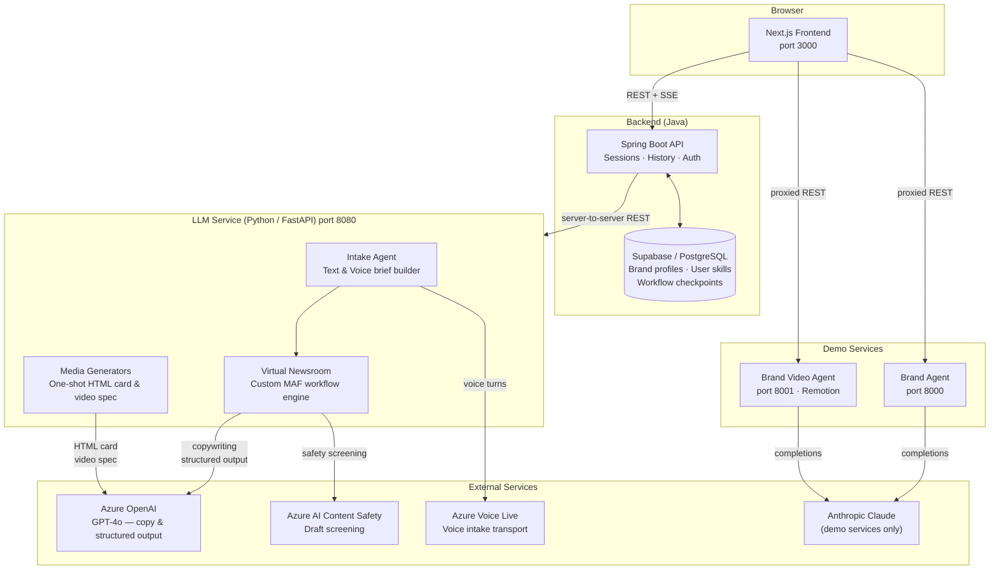
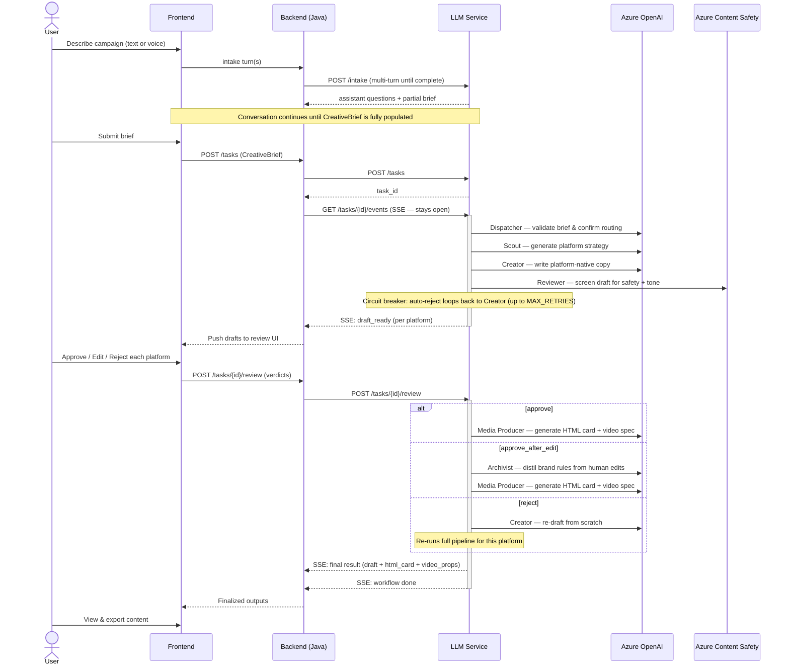
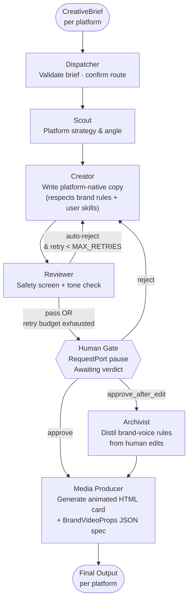
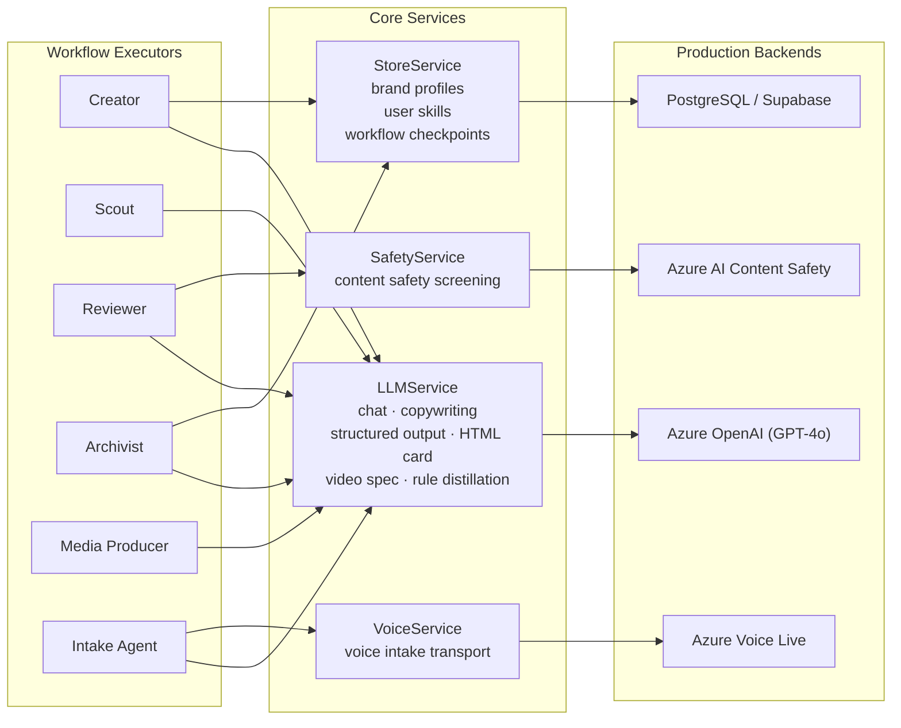
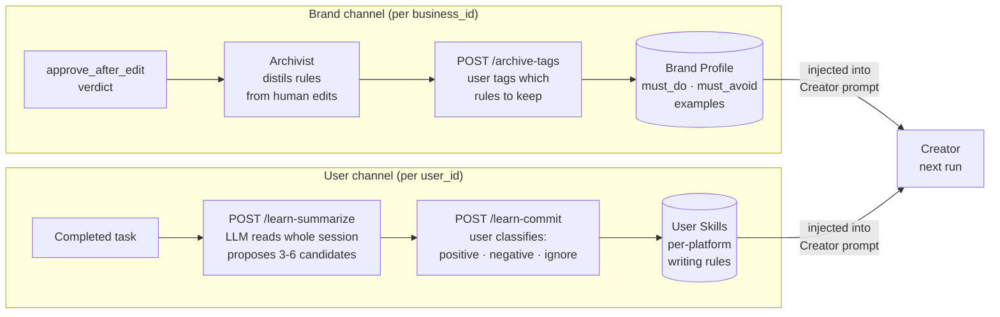

# TeamStarlight — System Architecture

## Service Overview

---

## Core Content Generation Workflow

The LLM service runs a single continuous pipeline per platform. An automated reviewer acts as a circuit breaker before surfacing drafts to a human.

---

## Virtual Newsroom Pipeline (Inside the Workflow Engine)

Each platform runs its own instance of this pipeline. The circuit breaker on the Reviewer prevents low-quality drafts from ever reaching the human gate.

---

## Backing Services

All four services have mock implementations for development and testing. Production services require separately-provisioned Azure/Postgres credentials.

---

## API Surface (Java Backend — port 8081)

All session and content endpoints require `Authorization: Bearer <token>` except `/login` and `/signIn`.

| Group | Endpoint | Purpose |
|---|---|---|
| **Auth** | `POST /login` | Verify credentials, return `{"token": "<jwt>"}` |
| **Signup** | `POST /signIn` | Register a new business account |
| **Sessions** | `POST /api/sessions` | Create a session — calls LLM `/intake`, persists to DB, associates with authenticated user |
| | `GET /api/sessions` | List sessions for the authenticated user |
| | `GET /api/sessions/{id}/messages` | Fetch stored messages for a session |
| | `POST /api/sessions/{id}/messages` | Append a message to a session |

### Auth flow
Login issues a JWT (7-day expiry, HMAC-SHA256) encoding the `businessId`. Clients send it as `Authorization: Bearer <token>` on every protected request. The secret is configured via the `JWT_SECRET` env var (defaults to a development placeholder).

---

## API Surface (LLM Service — port 8080)

| Group | Endpoint | Purpose |
|---|---|---|
| **Intake** | `POST /intake` | Start a brief-building conversation (text or voice) |
| | `POST /intake/{sid}/turn` | Send next user message |
| | `WS /intake/{sid}/voice` | WebSocket voice entry point |
| | `GET /intake/{sid}/brief` | Retrieve completed `CreativeBrief` |
| **Workflow** | `POST /tasks` | Submit brief, start generation pipeline |
| | `GET /tasks/{id}/events` | SSE stream — live progress & results |
| | `POST /tasks/{id}/review` | Submit approve / edit / reject verdicts |
| | `GET /tasks/{id}` | Fetch current task snapshot |
| **Learning** | `POST /tasks/{id}/archive-tags` | Save proposed brand-voice rules to brand profile |
| | `POST /tasks/{id}/learn-summarize` | Propose per-user writing rule candidates |
| | `POST /tasks/{id}/learn-commit` | Classify and persist user rule decisions |
| **Media** | `POST /generate-text` | One-shot platform copy — accepts optional `history: [{role, content}]` for multi-turn continuity |
| | `POST /generate` | One-shot animated HTML brand card — accepts optional `history` |
| | `POST /generate-video` | Start a `BrandVideoProps` spec job — accepts optional `history` |
| | `GET /jobs/{job_id}` | Fetch video spec JSON |

---

## Personalization Layer

The system learns two independent style profiles that are injected into every future draft.

> **Note on video rendering:** The LLM service produces a `StoryboardSpec` JSON only — no MP4. Rendering the MP4 (Remotion + headless Chromium, asset resolution) is a separate, explicitly-triggered job (`POST /tasks/{id}/render-video`). The storyboard LLM also authors the video's **audio**: background-music mood/genre/energy on `StoryboardSpec.audio` (agent-selected from a curated vocabulary, synthesized via Soundraw), and a **per-slide narration** line on each slide plus a voice persona (synthesized via Azure Speech's natural Dragon HD voices). Each slide's narration is synthesized to its own clip and played *inside that slide's sequence*, so the voice stays synced to the visuals; slides stretch to fit their narration so speech is never clipped. Narration is on by default; the render trigger can override the whole script/voice (`narration_text`/`narration_voice`) or suppress it (`narration_enabled: false`). Every track degrades gracefully — a synthesis failure yields a silent/unnarrated render, never a blocked one.
